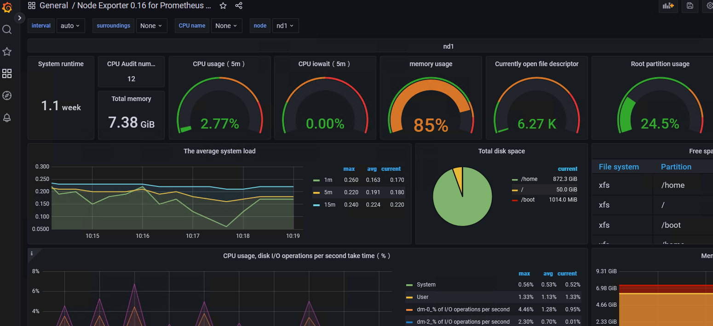
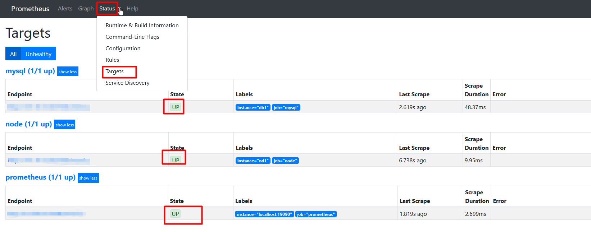
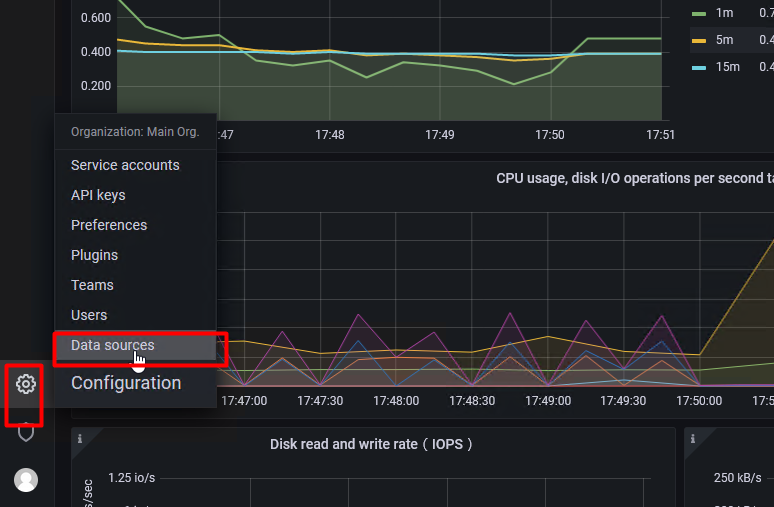
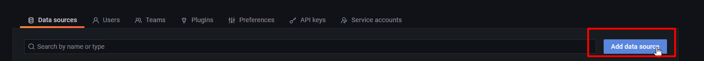
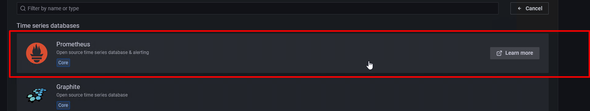
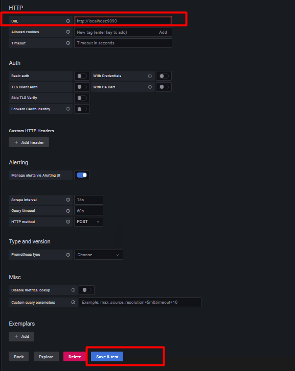
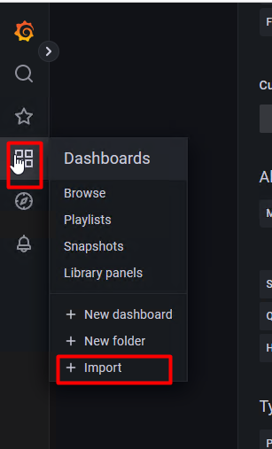
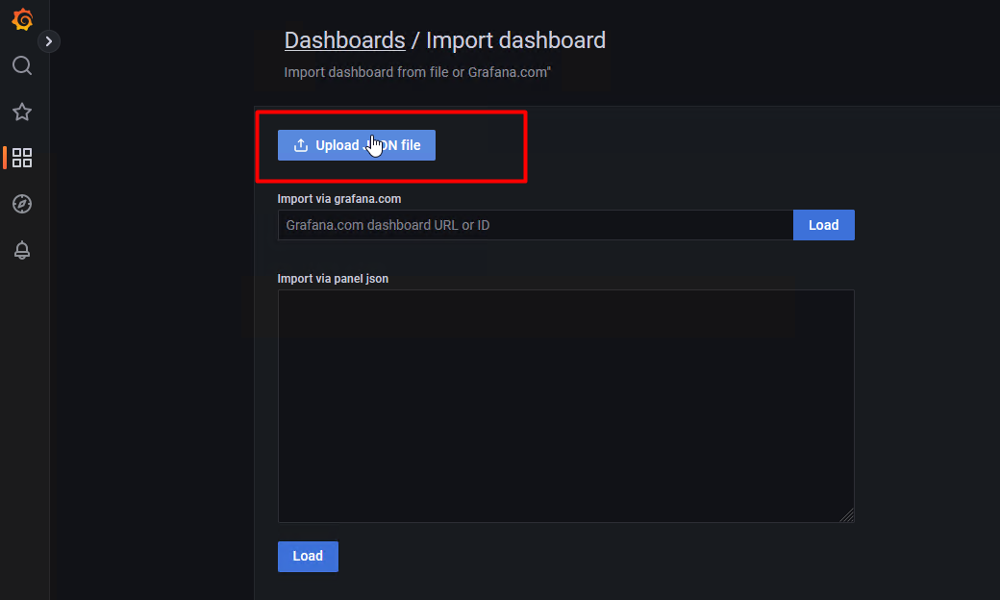

## CentOS7环境下,Grafana9结合Prometheus,node_exporter,mysqld_exporter监控平台搭建


### 效果

- 系统监控

  

- Mysql监控

  


### 要求

**为简化操作，所有软件均在一台服务器上运行**

**其他软件及版本如下表格所示**

| 系统/软件              | 版本    |      |
| ---------------------- | ------- | ---- |
| 系统                   | CentOS7 |      |
| Grafana                | 9.3.2   |      |
| node_exporter          | 0.17.0  |      |
| mysqld_exporter        | 0.11.0  |      |
| grafana-piechart-panel | 1.6.4   |      |
| Prometheus             | 2.8.1   |      |

------


### 背景及功能

**Prometheus** 是一套开源的系统监控报警框架。Prometheus 所有采集的监控数据均以指标（metric）的形式保存在内置的时间序列[数据库](https://cloud.tencent.com/solution/database?from=10680)当中（TSDB）：属于同一指标名称，同一标签集合的、有时间戳标记的数据流。除了存储的时间序列，Prometheus 还可以根据查询请求产生临时的、衍生的时间序列作为返回结果

**Grafana** 是一个跨平台的开源的度量分析和可视化工具，可以通过将采集的数据查询然后可视化的展示，并及时通知

**node_exporter** 采集系统指标信息并暴露HTTP接口

**mysqld_exporter** 采集Mysql指标信息并暴露HTTP接口

**grafana-piechart-panel**  用于在**Grafana** 平台查看饼状图

总而言之：**Prometheus** 采集**node_exporter**  、**mysqld_exporter**  提供的原始数据给  **Grafana** 平台做展示

------


### 安装


1. node_exporter

   1. 上传`node_exporter-0.17.0.linux-amd64.tar.gz`到服务器
      
   2. 解压 => `tar zxvf  node_exporter-0.17.0.linux-amd64.tar.gz `

   3. 放到指定目录 => `mv  node_exporter-0.17.0.linux-amd64 /opt/node_exporter`

   4. 运行 

      1. `cd /opt/node_exporter `

      2. `nohup ./node_exporter &`
      
         ------
      
         

2. mysqld_exporter

   1. 上传`mysqld_exporter-0.11.0.linux-amd64.tar.gz`到服务器
   
   2. 解压 => `tar zxvf  mysqld_exporter-0.11.0.linux-amd64.tar.gz`
   
   3. 放到指定目录 => `mv  mysqld_exporter-0.11.0.linux-amd64 /opt/mysqld_exporter`
   
   4. 创建Mysql监控账号（不创建也行）
   
   5. 编辑`mysqld_exporter`配置信息
      1. `cd /opt/mysqld_exporter `
      2. `vim .my.cnf` ，内容如下：
         ```
         [client]
         user=root
         password=123456
         host=127.0.0.1
         port=3309
         ```
      
   6. 启动 `nohup ./mysqld_exporter --config.my-cnf=.my.cnf &`
   
      ------
   
      
   
3. prometheus

   1. 上传`prometheus-2.8.1.linux-amd64.tar.gz`到服务器

   2. 解压  => `tar zxvf  prometheus-2.8.1.linux-amd64.tar.gz `

   3. 放到指定目录  =>  `mv  prometheus-2.8.1.linux-amd64  /opt/prometheus`

   4. 修改配置文件

      1. `vim prometheus.yml`

      2. 配置文件内容如下： 注意我这里将端口调整为`19090`  ;每个job_name标签标示一个监控的job targets 标签标示受监控的应用的 ip和端口号

        ```yml
        # my global config
        global:
          scrape_interval:     15s # Set the scrape interval to every 15 seconds. Default is every 1 minute.
          evaluation_interval: 15s # Evaluate rules every 15 seconds. The default is every 1 minute.
          # scrape_timeout is set to the global default (10s).

        # Alertmanager configuration
        alerting:
          alertmanagers:
          - static_configs:
            - targets:
              # - alertmanager:9093

        # Load rules once and periodically evaluate them according to the global 'evaluation_interval'.
        rule_files:
          # - "first_rules.yml"
          # - "second_rules.yml"

        # A scrape configuration containing exactly one endpoint to scrape:
        # Here it's Prometheus itself.
        scrape_configs:
          # The job name is added as a label `job=<job_name>` to any timeseries scraped from this config.
          - job_name: 'prometheus'

            # metrics_path defaults to '/metrics'
            # scheme defaults to 'http'.

            static_configs:
            - targets: ['localhost:19090']

          - job_name: 'mysql'
            static_configs:
            - targets: ['localhost:9104']
              labels:
                instance: 'db1'

          - job_name: 'node'
            static_configs:
            - targets: ['localhost:9100']
              labels:
                instance: 'nd1'
        ```
      
   5. 启动 =>  `nohup ./prometheus --config.file=./prometheus.yml &`      （如果启动失败。可以用前台启动的方式查看日志，我这里端口由于改成了`19090`，所以启动参数改为了 ``nohup ./prometheus --config.file=./prometheus.yml --web.listen-address=:19090 > /dev/null 2>&1 &`）

   6. 查看`prometheus`启动是否正常以及采集的`node_exporter、mysqld_exporter`指标数据是否已接收到

      1. 登录网页（`http://你的ip:你的端口(默认9090)`），如：`http://localhost:9090`

      2. 依次点击 `Status -> Targets`

         
         
      3. 查看`State`是否都是`Up`状态，如果不是Up状态，需要重新看下`node_exporter、mysqld_exporter`配置
      

4. Grafana

   1. 安装 -> 请查看`MyPerf4J结合Grafana和InfluxDB采集JVM以及QPS指标`文章，进行`Grafana`的安装

   2. 登录`Grafana` web平台

   3. 配置`prometheus`数据源

        1. 点击`Data sources`

           
           
             2. 点击`Add data source`
           
                 
                 
             3. 点击`Prometheus`
           
                 
           
             4. 填写`URL`（注意`prometheus`端口是否修改）
           
                 
           
             5. 点击`Save & test`，如果正常会提示绿色信息 


------


5. 上传Mysql和系统监控的`DashBoards`

   1. 点击`Import`

      
   
   2. 点击`Upload Json`,分别选择`mysql-overview_rev5 、node-exporter-0-16-for-prometheus-monitoring-display-board_rev2`进行上传
   
      
   
   3. 上传完成后可以在`dashboards`进行查看
   
      
   


