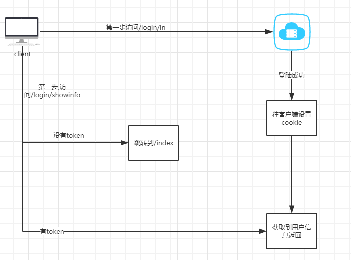

## **<a id="t1">Spring boot session Redis简单实现</a>**

1. `pom.xml`增加依赖,[[配置地址](spring-boot/spring-boot-single-point/spring-boot-single-point-server01/pom.xml)

   ```xml
           <dependency>
               <groupId>org.springframework.session</groupId>
               <artifactId>spring-session-data-redis</artifactId>
           </dependency>
           <dependency>
               <groupId>org.springframework.session</groupId>
               <artifactId>spring-session-core</artifactId>
           </dependency>
           <dependency>
               <groupId>redis.clients</groupId>
               <artifactId>jedis</artifactId>
               <version>2.9.1</version>
           </dependency>
   ```

2. 增加`redis`配置,[配置地址](spring-boot/spring-boot-single-point/spring-boot-single-point-server01/src/main/resources/application.properties)

   ```properties
   ############################################################
   #
   # REDIS 配置
   #
   ############################################################
   # Redis数据库索引（默认为0）
   spring.redis.database=1
   # Redis服务器地址
   spring.redis.host=localhost
   # Redis服务器连接端口
   spring.redis.port=6379
   # Redis服务器连接密码（默认为空）
   #spring.redis.password=
   
   # 连接超时时间（毫秒）
   spring.redis.timeout=0
   
   server.port=8881
   
   spring.session.store-type=REDIS
   #过期时间
   #spring.session.timeout=60*60*24*2
   # Namespace for keys used to store sessions.  redis key 前缀
   spring.session.redis.namespace=spring:session
   ```

3. 增加`redis pool`配置, [配置地址](spring-boot/spring-boot-single-point/spring-boot-single-point-server01/src/main/java/cn/withmes/spring/boot/single/point/server01/RedisConnectionFactoryConfig.java)

   ```java
   /**
    * @Project:
    * @Author: leegoo
    * @Date: 2019年07月22日
    */
   package cn.withmes.spring.boot.single.point.server01;
   
   import org.springframework.beans.factory.annotation.Value;
   import org.springframework.context.annotation.Bean;
   import org.springframework.context.annotation.Configuration;
   import org.springframework.data.redis.connection.RedisPassword;
   import org.springframework.data.redis.connection.RedisStandaloneConfiguration;
   import org.springframework.data.redis.connection.jedis.JedisClientConfiguration;
   import org.springframework.data.redis.connection.jedis.JedisConnectionFactory;
   import redis.clients.jedis.JedisPoolConfig;
   
   import java.time.Duration;
   
   /**
    * ClassName: RedisConnectionFactory
    *
    * @author leegoo
    * @Description:
    * @date 2019年07月22日
    */
   @Configuration
   public class RedisConnectionFactoryConfig {
   
   
       @Value("${spring.redis.host}")
       private String redisHost;
   
       @Value("${spring.redis.port}")
       private int redisPort;
   
       @Value("${spring.redis.timeout}")
       private int redisTimeout;
   
   //    @Value("${spring.redis.password}")
   //    private String redisAuth;
   
       @Value("${spring.redis.database}")
       private int redisDb;
   
   //    @Value("${spring.redis.jedis.pool.max-active}")
   //    private int maxActive;
   
   //    @Value("${spring.redis.jedis.pool.max-wait}")
   //    private int maxWait;
   
   //    @Value("${spring.redis.jedis.pool.max-idle}")
   //    private int maxIdle;
   
   //    @Value("${spring.redis.jedis.pool.min-idle}")
   //    private int minIdle;
   
       @Bean
       public JedisConnectionFactory connectionFactory() {
           JedisPoolConfig poolConfig = new JedisPoolConfig();
           //poolConfig.setMaxTotal(maxActive);
   //        poolConfig.setMaxIdle(maxIdle);
   //        poolConfig.setMaxWaitMillis(maxWait);
   //        poolConfig.setMinIdle(minIdle);
           poolConfig.setTestOnBorrow(true);
           poolConfig.setTestOnReturn(false);
           poolConfig.setTestWhileIdle(true);
           JedisClientConfiguration clientConfig = JedisClientConfiguration.builder()
                   .usePooling().poolConfig(poolConfig).and().readTimeout(Duration.ofMillis(redisTimeout)).build();
   
           // 单点redis
           RedisStandaloneConfiguration redisConfig = new RedisStandaloneConfiguration();
           // 哨兵redis
           // RedisSentinelConfiguration redisConfig = new RedisSentinelConfiguration();
           // 集群redis
           // RedisClusterConfiguration redisConfig = new RedisClusterConfiguration();
           redisConfig.setHostName(redisHost);
           //redisConfig.setPassword(RedisPassword.of(redisAuth));
           redisConfig.setPort(redisPort);
           redisConfig.setDatabase(redisDb);
   
           return new JedisConnectionFactory(redisConfig, clientConfig);
       }
   
   }
   
   ```

4. 启动类增加配置

   ```java
   package cn.withmes.spring.boot.single.point.server01;
   
   import org.springframework.beans.factory.annotation.Autowired;
   import org.springframework.beans.factory.annotation.Qualifier;
   import org.springframework.beans.factory.annotation.Value;
   import org.springframework.boot.SpringApplication;
   import org.springframework.boot.autoconfigure.SpringBootApplication;
   import org.springframework.context.annotation.Bean;
   import org.springframework.data.redis.connection.RedisConnectionFactory;
   import org.springframework.data.redis.connection.RedisPassword;
   import org.springframework.data.redis.connection.RedisStandaloneConfiguration;
   import org.springframework.data.redis.connection.jedis.JedisClientConfiguration;
   import org.springframework.data.redis.connection.jedis.JedisConnectionFactory;
   import org.springframework.data.redis.core.RedisTemplate;
   import org.springframework.data.redis.core.StringRedisTemplate;
   import org.springframework.session.data.redis.config.annotation.web.http.EnableRedisHttpSession;
   import org.springframework.web.bind.annotation.GetMapping;
   import org.springframework.web.bind.annotation.RequestMapping;
   import org.springframework.web.bind.annotation.RestController;
   import redis.clients.jedis.JedisPoolConfig;
   
   import javax.servlet.Filter;
   import javax.servlet.FilterChain;
   import javax.servlet.ServletException;
   import javax.servlet.ServletRequest;
   import javax.servlet.ServletResponse;
   import javax.servlet.http.HttpServlet;
   import javax.servlet.http.HttpServletRequest;
   import java.io.IOException;
   import java.time.Duration;
   
   @SpringBootApplication
   @EnableRedisHttpSession
   public class SinglePointServer01 {
   
   
       public static void main(String[] args) {
           SpringApplication.run(SinglePointServer01.class, args);
       }
   
   
   
       @RestController
       @RequestMapping("/user")
       public class UserController {
   
           @GetMapping("/token")
           public String saveUserInfoRedis(HttpServletRequest request) {
               request.getSession().setAttribute("xm","this is my userinfo" );
               return "success";
           }
   
           @GetMapping("/token/get")
           public String getUserInfo(HttpServletRequest request) {
               return (String)request.getSession().getAttribute("xm");
           }
       }
   }
   
   ```

5. 通过访问`http://localhost:8881/user/token`,再访问`http://localhost:8881/user/token/get`即可看到设置的session,可到`target`目录下,使用`java -jar projectname --server.port=your port` 执行多份,`redis`中也可以看到新增加的key`spring:session:*`


## **<a id="t2">Spring boot JWT 实现</a>**

水平有限,不喜勿喷

1. jwt 介绍  
   - 主要分为三部分 
     - **Header**(定义使用什么算法加解密)
     - **Payload** (需要放的内容)
     - **Signature** (类似于私钥,就好比与WX的私钥差不多,别人不知道的话拿到一串加密的数字无法解密)
   
2.  jwt与session的区别
   
- 主要是session在集群之下共享的问题,jwt存在客户端 ,服务端只是做加密解密,所以性能很好,也解决了单点的问题
   
3.  调用流程如下:

   

4. 首先在`pom.xml`文件加入依赖  

   ```xml
   
           <dependency>
               <groupId>io.jsonwebtoken</groupId>
               <artifactId>jjwt</artifactId>
               <version>0.9.1</version>
           </dependency>
   
   		<!-- 处理时间 -->
           <dependency>
               <groupId>joda-time</groupId>
               <artifactId>joda-time</artifactId>
               <version>2.9.9</version>
           </dependency>
   
   		<!-- 模板引擎不是必要依赖 -->
           <dependency>
               <groupId>org.springframework.boot</groupId>
               <artifactId>spring-boot-starter-thymeleaf</artifactId>
           </dependency>
   ```

5. `application.yaml`加入配置

   ```yaml
   spring:
     freemarker:
       cache: false
       charset: UTF-8
       check-template-location: true
       suffix: .html
       template-loader-path: classpath:/templates
       request-context-attribute: request
   ```

6. 增加cookie处理类,和jwt加解密类

   ```java
   /**
    * @Project:
    * @Author: leegoo
    * @Date: 2019年07月22日
    */
   package cn.withmes.springboot.singlepointjwt;
   
   /**
    * ClassName: CookieUtils
    * @Description:
    * @author leegoo
    * @date 2019年07月22日
    */
   
   import java.io.UnsupportedEncodingException;
   import java.net.URLDecoder;
   import java.net.URLEncoder;
   
   import javax.servlet.http.Cookie;
   import javax.servlet.http.HttpServletRequest;
   import javax.servlet.http.HttpServletResponse;
   
   
   /**
    *
    * Cookie 工具类
    *
    */
   public final class CookieUtils {
   
       /**
        * 得到Cookie的值, 不编码
        *
        * @param request
        * @param cookieName
        * @return
        */
       public static String getCookieValue(HttpServletRequest request, String cookieName) {
           return getCookieValue(request, cookieName, false);
       }
   
       /**
        * 得到Cookie的值,
        *
        * @param request
        * @param cookieName
        * @return
        */
       public static String getCookieValue(HttpServletRequest request, String cookieName, boolean isDecoder) {
           Cookie[] cookieList = request.getCookies();
           if (cookieList == null || cookieName == null) {
               return null;
           }
           String retValue = null;
           try {
               for (int i = 0; i < cookieList.length; i++) {
                   if (cookieList[i].getName().equals(cookieName)) {
                       if (isDecoder) {
                           retValue = URLDecoder.decode(cookieList[i].getValue(), "UTF-8");
                       } else {
                           retValue = cookieList[i].getValue();
                       }
                       break;
                   }
               }
           } catch (UnsupportedEncodingException e) {
               e.printStackTrace();
           }
           return retValue;
       }
   
       /**
        * 得到Cookie的值,
        *
        * @param request
        * @param cookieName
        * @return
        */
       public static String getCookieValue(HttpServletRequest request, String cookieName, String encodeString) {
           Cookie[] cookieList = request.getCookies();
           if (cookieList == null || cookieName == null) {
               return null;
           }
           String retValue = null;
           try {
               for (int i = 0; i < cookieList.length; i++) {
                   if (cookieList[i].getName().equals(cookieName)) {
                       retValue = URLDecoder.decode(cookieList[i].getValue(), encodeString);
                       break;
                   }
               }
           } catch (UnsupportedEncodingException e) {
               e.printStackTrace();
           }
           return retValue;
       }
   
       /**
        * 设置Cookie的值 不设置生效时间默认浏览器关闭即失效,也不编码
        */
       public static void setCookie(HttpServletRequest request, HttpServletResponse response, String cookieName,
                                    String cookieValue) {
           setCookie(request, response, cookieName, cookieValue, -1);
       }
   
       /**
        * 设置Cookie的值 在指定时间内生效,但不编码
        */
       public static void setCookie(HttpServletRequest request, HttpServletResponse response, String cookieName,
                                    String cookieValue, int cookieMaxage) {
           setCookie(request, response, cookieName, cookieValue, cookieMaxage, false);
       }
   
       /**
        * 设置Cookie的值 不设置生效时间,但编码
        */
       public static void setCookie(HttpServletRequest request, HttpServletResponse response, String cookieName,
                                    String cookieValue, boolean isEncode) {
           setCookie(request, response, cookieName, cookieValue, -1, isEncode);
       }
   
       /**
        * 设置Cookie的值 在指定时间内生效, 编码参数
        */
       public static void setCookie(HttpServletRequest request, HttpServletResponse response, String cookieName,
                                    String cookieValue, int cookieMaxage, boolean isEncode) {
           doSetCookie(request, response, cookieName, cookieValue, cookieMaxage, isEncode);
       }
   
       /**
        * 设置Cookie的值 在指定时间内生效, 编码参数(指定编码)
        */
       public static void setCookie(HttpServletRequest request, HttpServletResponse response, String cookieName,
                                    String cookieValue, int cookieMaxage, String encodeString) {
           doSetCookie(request, response, cookieName, cookieValue, cookieMaxage, encodeString);
       }
   
       /**
        * 删除Cookie带cookie域名
        */
       public static void deleteCookie(HttpServletRequest request, HttpServletResponse response,
                                       String cookieName) {
           doSetCookie(request, response, cookieName, "", -1, false);
       }
   
       /**
        * 设置Cookie的值，并使其在指定时间内生效
        *
        * @param cookieMaxage cookie生效的最大秒数
        */
       private static final void doSetCookie(HttpServletRequest request, HttpServletResponse response,
                                             String cookieName, String cookieValue, int cookieMaxage, boolean isEncode) {
           try {
               if (cookieValue == null) {
                   cookieValue = "";
               } else if (isEncode) {
                   cookieValue = URLEncoder.encode(cookieValue, "utf-8");
               }
               Cookie cookie = new Cookie(cookieName, cookieValue);
               if (cookieMaxage > 0)
                   cookie.setMaxAge(cookieMaxage);
               if (null != request) {// 设置域名的cookie
                   String domainName = getDomainName(request);
                   System.out.println(domainName);
                   if (!"localhost".equals(domainName)) {
                       cookie.setDomain(domainName);
                   }
               }
               cookie.setPath("/");
               response.addCookie(cookie);
           } catch (Exception e) {
               e.printStackTrace();
           }
       }
   
       /**
        * 设置Cookie的值，并使其在指定时间内生效
        *
        * @param cookieMaxage cookie生效的最大秒数
        */
       private static final void doSetCookie(HttpServletRequest request, HttpServletResponse response,
                                             String cookieName, String cookieValue, int cookieMaxage, String encodeString) {
           try {
               if (cookieValue == null) {
                   cookieValue = "";
               } else {
                   cookieValue = URLEncoder.encode(cookieValue, encodeString);
               }
               Cookie cookie = new Cookie(cookieName, cookieValue);
               if (cookieMaxage > 0)
                   cookie.setMaxAge(cookieMaxage);
               if (null != request) {// 设置域名的cookie
                   String domainName = getDomainName(request);
                   System.out.println(domainName);
                   if (!"localhost".equals(domainName)) {
                       cookie.setDomain(domainName);
                   }
               }
               cookie.setPath("/");
               response.addCookie(cookie);
           } catch (Exception e) {
               e.printStackTrace();
           }
       }
   
       /**
        * 得到cookie的域名
        */
       private static final String getDomainName(HttpServletRequest request) {
           String domainName = null;
   
           String serverName = request.getRequestURL().toString();
           if (serverName == null || serverName.equals("")) {
               domainName = "";
           } else {
               serverName = serverName.toLowerCase();
               serverName = serverName.substring(7);
               final int end = serverName.indexOf("/");
               serverName = serverName.substring(0, end);
               final String[] domains = serverName.split("\\.");
               int len = domains.length;
               if (len > 3) {
                   // www.xxx.com.cn
                   domainName = "." + domains[len - 3] + "." + domains[len - 2] + "." + domains[len - 1];
               } else if (len <= 3 && len > 1) {
                   // xxx.com or xxx.cn
                   domainName = "." + domains[len - 2] + "." + domains[len - 1];
               } else {
                   domainName = serverName;
               }
           }
   
           if (domainName != null && domainName.indexOf(":") > 0) {
               String[] ary = domainName.split("\\:");
               domainName = ary[0];
           }
           return domainName;
       }
   
   }
   ```

   ```java
   /**
    * @Project:
    * @Author: leegoo
    * @Date: 2019年07月22日
    */
   package cn.withmes.springboot.singlepointjwt;
   
   import com.fasterxml.jackson.core.JsonProcessingException;
   import com.fasterxml.jackson.databind.ObjectMapper;
   import io.jsonwebtoken.Claims;
   import io.jsonwebtoken.Jws;
   import io.jsonwebtoken.Jwts;
   import io.jsonwebtoken.SignatureAlgorithm;
   
   import javax.crypto.spec.SecretKeySpec;
   import javax.xml.bind.DatatypeConverter;
   import java.util.Map;
   
   /**
    * ClassName: JWTUtil
    *
    * @author leegoo
    * @Description: jwt 工具类
    * @date 2019年07月22日
    */
   public class JWTUtil {
   
       public static String generatorToken(Map<String, Object> payload) {
   
           try {
               String token = Jwts.builder().setPayload(new ObjectMapper().writeValueAsString(payload))
                       .signWith(SignatureAlgorithm.HS256, createKey())
                       .compact();
               return token;
           } catch (JsonProcessingException e) {
               e.printStackTrace();
               return null;
           }
       }
   
   
       private static SecretKeySpec createKey() {
           byte[] bin = DatatypeConverter.parseBase64Binary("leegookey");
           return new SecretKeySpec(bin, SignatureAlgorithm.HS256.getJcaName());
       }
   
       public static Claims parseToken(String key) {
           Jws<Claims> claimsJws = Jwts.parser().setSigningKey(createKey()).parseClaimsJws(key);
           return claimsJws.getBody();
       }
   }
   
   ```

7. 编写注解类,只有带了注解的才去拦截

   ```java
   /**
    * @Project:
    * @Author: leegoo
    * @Date: 2019年07月22日
    */
   package cn.withmes.springboot.singlepointjwt;
   
   import java.lang.annotation.Documented;
   import java.lang.annotation.ElementType;
   import java.lang.annotation.Inherited;
   import java.lang.annotation.Retention;
   import java.lang.annotation.RetentionPolicy;
   import java.lang.annotation.Target;
   
   /**
    * ClassName: JWTAnnotation
    * @Description: 标记需要拦截的类
    * @author leegoo
    * @date 2019年07月22日
    */
   
   @Documented
   @Target({ElementType.METHOD})
   @Inherited
   @Retention(value = RetentionPolicy.RUNTIME)
   public @interface JWTAnnotation  {
   }
   
   ```

8. 编写返回体

   ```java
   /**
    * @Project:
    * @Author: leegoo
    * @Date: 2019年07月22日
    */
   package cn.withmes.springboot.singlepointjwt;
   
   /**
    * ClassName: Response
    * @Description: 响应体
    * @author leegoo
    * @date 2019年07月22日
    */
   public class ResponseData<E> {
   
       private  String token ;
   
       private E data;
   
       private  int code ;
   
       private String msg ;
   
       public ResponseData( ) {
           this.code = -1;
       }
   
       public ResponseData(int code) {
           this.code = code;
       }
   
       public String getToken() {
           return token;
       }
   
       public void setToken(String token) {
           this.token = token;
       }
   
       public E getData() {
           return data;
       }
   
       public void setData(E data) {
           this.data = data;
       }
   
       public int getCode() {
           return code;
       }
   
       public void setCode(int code) {
           this.code = code;
       }
   
       public String getMsg() {
           return msg;
       }
   
       public void setMsg(String msg) {
           this.msg = msg;
       }
   }
   
   ```

9. 编写控制层

   ```java
   /**
    * @Project:
    * @Author: leegoo
    * @Date: 2019年07月22日
    */
   package cn.withmes.springboot.singlepointjwt;
   
   import org.joda.time.DateTime;
   import org.springframework.lang.NonNull;
   import org.springframework.lang.Nullable;
   import org.springframework.stereotype.Controller;
   import org.springframework.ui.Model;
   import org.springframework.util.StringUtils;
   import org.springframework.web.bind.annotation.GetMapping;
   import org.springframework.web.bind.annotation.RequestMapping;
   import org.springframework.web.bind.annotation.RequestMethod;
   import org.springframework.web.bind.annotation.ResponseBody;
   import org.springframework.web.bind.annotation.RestController;
   import org.springframework.web.servlet.ModelAndView;
   
   import javax.annotation.PostConstruct;
   import javax.servlet.http.HttpServletRequest;
   import javax.servlet.http.HttpServletResponse;
   import java.util.HashMap;
   import java.util.Map;
   import java.util.concurrent.ConcurrentHashMap;
   
   /**
    * ClassName: MyController
    *
    * @author leegoo
    * @Description:
    * @date 2019年07月22日
    */
   @Controller
   public class MyController {
   
       /**
        * @Description:模拟保存用户数据
        * @param: 
        * @return: 
        * @auther: liming
        * @date: 7/23/2019 7:26 PM
        */
       public static Map<String, User> userinfoMap = new ConcurrentHashMap<>(16);
   
       @PostConstruct
       public void init() {
           userinfoMap.put("zhangfei", new User("zhangfei", "123"));
       }
   
   
       @RequestMapping(value = "index", method = RequestMethod.GET)
       public ModelAndView index() {
           return new ModelAndView("index");
       }
   
   
       @GetMapping("/error")
       public ModelAndView error(HttpServletRequest request) {
           String msg = request.getParameter("msg");
           ModelAndView view = new ModelAndView();
           view.addObject("msg", msg);
           return view;
       }
   
       
       /**
        * @Description:展示信息
        * @param: 
        * @return: 
        * @auther: liming
        * @date: 7/23/2019 7:25 PM
        */
       @RequestMapping(value = "/login/showinfo", method = RequestMethod.GET)
       @ResponseBody
       @JWTAnnotation
       public ModelAndView showinfo(String username) {
           if (StringUtils.isEmpty(username)) {
               ModelAndView info = new ModelAndView("error");
               info.addObject("errorMsg", "账号为空!");
               return info;
           }
           ModelAndView info = new ModelAndView("info");
           User user = userinfoMap.get(username);
           user.setPwd(null);
           info.addObject("Info", user);
           return info;
       }
   
   
       /**
        * @Description:登陆
        * @param: 
        * @return: 
        * @auther: liming
        * @date: 7/23/2019 7:25 PM
        */
       @GetMapping("/login/in")
       @ResponseBody
       public ResponseData<User> loginin(@NonNull String username, @NonNull String pwd, HttpServletResponse response) {
           ResponseData<User> data = null;
           if (StringUtils.isEmpty(username) || StringUtils.isEmpty(pwd)) {
               data = new ResponseData<>();
               data.setMsg("用户名或者密码不能为空");
               return data;
           }
           if (!userinfoMap.containsKey(username) || !userinfoMap.get(username).getPwd().equalsIgnoreCase(pwd))
               return new ResponseData<>(-1);
           data = createUserToken(username);
           response.addHeader("Set-Cookie", "aceess_token=" + data.getToken());
           return data;
       }
   
       
       /**
        * @Description:生成token 
        * @param: 
        * @return: 
        * @auther: liming
        * @date: 7/23/2019 7:26 PM
        */
       public static ResponseData<User> createUserToken(@NonNull String username) {
           ResponseData<User> responseData = new ResponseData<>(-1);
           User user = userinfoMap.get(username);
           Map<String, Object> payload = new HashMap<>();
           payload.put("uukey", user.getUsername());
           payload.put("exp", DateTime.now().plusSeconds(40).toDate().getTime() / 1000);
           String token = JWTUtil.generatorToken(payload);
           responseData.setCode(0);
           responseData.setToken(token);
           responseData.setData(user);
           return responseData;
       }
   
   
   }
   
   ```

10. 前面这些基本工作做完了,然后编写拦截器, 主要针对带有`JWTAnnotation` 的方法进行拦截

    ```java
    /**
     * @Project:
     * @Author: leegoo
     * @Date: 2019年07月22日
     */
    package cn.withmes.springboot.singlepointjwt;
    
    import com.sun.javafx.geom.transform.SingularMatrixException;
    import io.jsonwebtoken.Claims;
    import io.jsonwebtoken.ExpiredJwtException;
    import org.springframework.context.annotation.Configuration;
    import org.springframework.util.StringUtils;
    import org.springframework.web.method.HandlerMethod;
    import org.springframework.web.servlet.config.annotation.InterceptorRegistry;
    import org.springframework.web.servlet.config.annotation.WebMvcConfigurer;
    import org.springframework.web.servlet.handler.HandlerInterceptorAdapter;
    
    import javax.servlet.http.HttpServletRequest;
    import javax.servlet.http.HttpServletResponse;
    import java.io.IOException;
    
    /**
     * ClassName: JWTInteruptHandler
     *
     * @author leegoo
     * @Description:
     * @date 2019年07月22日
     */
    @Configuration
    public class JWTInteruptHandler extends HandlerInterceptorAdapter implements WebMvcConfigurer {
    
        private final String ACCESS_TOKEN = "aceess_token";
    
        //拦截路径  需要实现 WebMvcConfigurer
        // 可添加多个
        @Override
        public void addInterceptors(InterceptorRegistry registry) {
            registry.addInterceptor(new JWTInteruptHandler()).addPathPatterns("/login/showinfo");
            registry.addInterceptor(new JWTInteruptHandler()).excludePathPatterns("/resource");
            registry.addInterceptor(new JWTInteruptHandler()).excludePathPatterns("/login/in");
            registry.addInterceptor(new JWTInteruptHandler()).excludePathPatterns("/index");
            registry.addInterceptor(new JWTInteruptHandler()).excludePathPatterns("/error");
        }
    
        @Override
        public boolean preHandle(HttpServletRequest request, HttpServletResponse response, Object handler) throws Exception {
            HandlerMethod handlerMethod = null;
            if (handler instanceof org.springframework.web.method.HandlerMethod) {
                handlerMethod = (HandlerMethod) handler;
            } else {
                return true;
            }
            if (checkAnnotation(handlerMethod)) return true;
    
            String cookieValue = CookieUtils.getCookieValue(request, this.ACCESS_TOKEN);
    
            // 如果cookie 没有 token 那么跳转到首页
            if (StringUtils.isEmpty(cookieValue)) {
                response.sendRedirect("/index");
                return false;
            }
    
            //解析jwt
            try {
                Claims claims = JWTUtil.parseToken(cookieValue);
                System.out.println(claims);
            } catch (ExpiredJwtException e) {
                dispose(response, "expire token .");
                return false;
            } catch (SingularMatrixException e) {
                dispose(response, "sign exception .");
                return false;
            }
            return super.preHandle(request, response, handler);
        }
    
        private void dispose(HttpServletResponse response, String msg) throws IOException {
            response.sendRedirect("/error?msg=" + msg);
        }
    
        /**
         * @Description:检查是否带有注解
         * @param:
         * @return:
         * @auther: liming
         * @date: 7/23/2019 7:27 PM
         */
        private boolean checkAnnotation(HandlerMethod handlerMethod) {
            return null == handlerMethod.getMethod().getAnnotation(JWTAnnotation.class);
        }
    }
    
    ```

    


