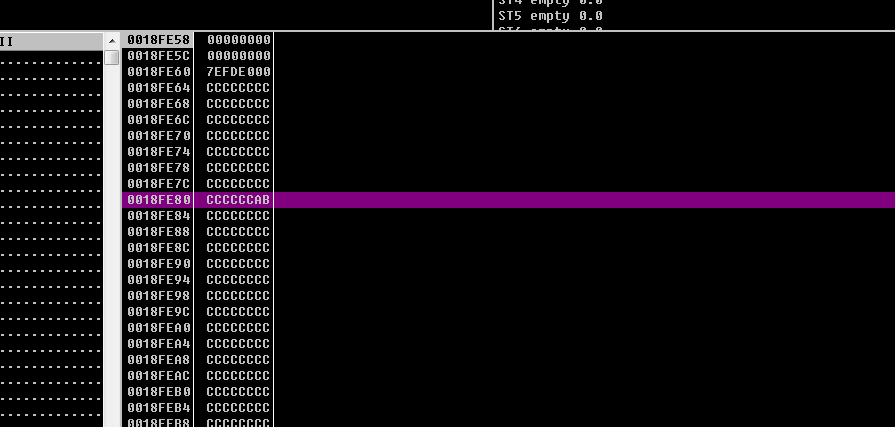
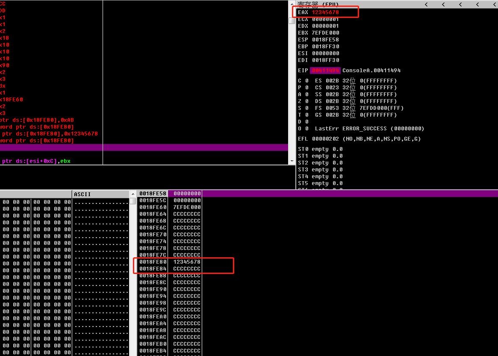

## 内存

BYTE 字节 =  8（BIT）

WORD = 16（BIT）

DWORD=32（BIT）


1KB=1024(BYTE)

1MB=1024KB

1GB=1024MB




可以把内存地址想象成EAX,ECX。只是因为内存的地址太多了。没有办法编写那么多符号

所以就只能用0x00000000这种代替。

### 操作系统寻址宽度

32位的操作系统支持寻址宽度 0x00000000~0xFFFFFFFF

0xFFFFFFFF  16位的寻址宽度是从0开始的。所以真正的寻址宽度还要+1  

 0xFFFFFFFF+1 代表字节数

0xFFFFFFFF+1 /1024 代表KB数

0xFFFFFFFF+1 /1024/1024 代表MB数

0xFFFFFFFF+1 /1024/1024/1024 代表GB数 = 4

所以32位的操作系统支持的最大内存是4GB（正常情况下。可以通过补码啥的吧扩大寻址宽度）


### 对内存地址写入数据

操作指令

mov byte ptr ds:[0x18FE80],0xAB

byte 要写入的字节数 ，此位置可以是 byte (1个字节)  word（2个字节） dword（4个字节）

ptr 指针（pointer ）

ds 段寄存器（Data Segment register）

0x18FE80 内存地址  。

[0x18FE80] 加中括号是为了与通用寄存器做区分

0xAB 写入的值

例子：

mov byte ptr ds:[0x18FE80],0xCCCCCCCC

mov byte ptr ds:[0x18FE80],0xAB  

命令执行后。 0x18FE80 内存地址的值等于 0xCCCCCCAB

因为只写入一个字节

16位的数可以表示4个bit。8个bit是1个字节。

所以改了最后2两位

### 对内存地址写入数据

mov dword ptr ds:[0x18FE80],0x12345678




这里可以看到内存0x0018FE80 下面一个就是0x0018FE84

说明中间省略了0x0018FE81 、0x0018FE82 、0x0018FE83

80~83 正好是4个字节。所以 0x0018FE80 可以写入12345678

#### 读取dword 4个字节的数到eax寄存器中

mov eax,dword ptr ds:[0x18FE80]

此时eax的值已经变成了12345678


### 取内存地址编号

LEA eax,dword ptr ds:[0x18FE80]

取 0x18FE80 这个内存编号放到eax寄存器中.而不是把0x18FE80内存编号的值放到eax中.

类似于 Object a = 1;

Object   b = a;


### 实现堆栈功能的方式

#### 方式一

~~~
lea ebp,dword ptr ds:[0x19FFB8]  //让ebp = 0x19FFB8这个地址 (当做栈底)

lea esp,dword ptr ds:[0x19FFB8]  //让esp = 0x19FFB8这个地址 (当做栈顶)

mov dword ptr ds:[esp-0x4],0xAAAAAAAA  //修改esp-4 对应的内存地址的值

sub esp,0x4 让esp对应的内存-4 ,原来esp 地址是 0x19FFB8, -4变成了 0x19FFB4
~~~

#### 方式二

```
lea ebp,dword ptr ds:[0x19FFB8]  //让ebp = 0x19FFB8这个地址 (当做栈底)

lea esp,dword ptr ds:[0x19FFB8]  //让esp = 0x19FFB8这个地址 (当做栈顶)

lea esp,dword ptr ds:[ebp-0x4]  //让esp对应的内存-4 ,原来esp 地址是 0x19FFB8, -4变成了 0x19FFB4

mov dword ptr ds:[esp],0x66666666 //修改esp-4 对应的内存地址的值
```


### PUSH

push eax

1.往eax 存入 esp-4个内存地址的值

2.esp = esp-4 的内存地址 

等同于上面实现的方式一/方式二任何一种

### POP

pop eax

1.往eax 存入 esp+4个内存地址的值

2.esp = esp+4 的内存地址 

