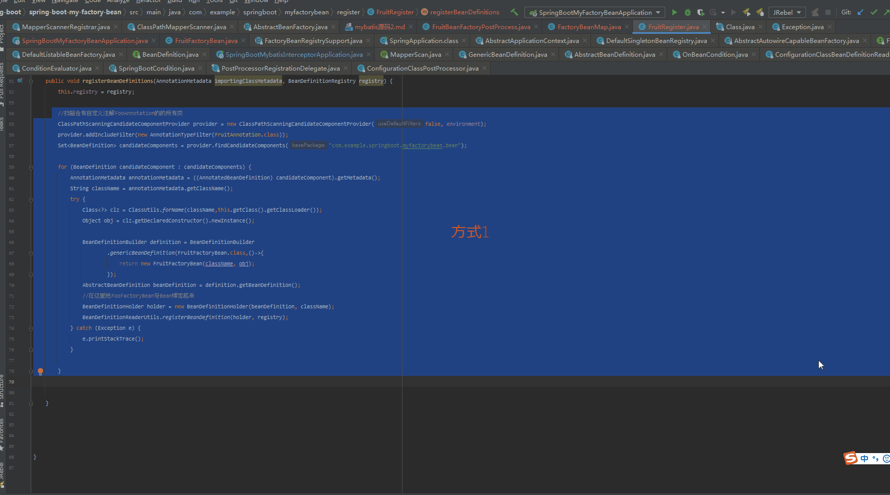
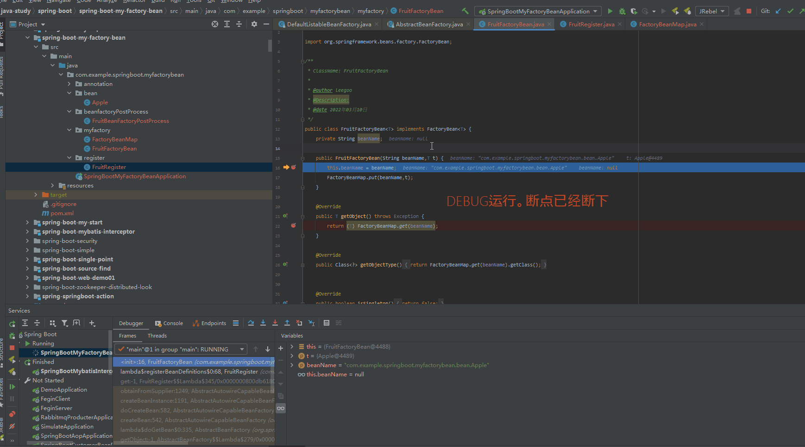

demo项目地址  `cn.withmes.springboot.mybatis.interceptor.SpringBootMybatisInterceptorApplication`

因为只有一个`UserMapper`

当我们在运行`main`函数。得到的结果 `org.apache.ibatis.binding.MapperProxy@329548d0`

大胆猜测。`UserMapper`是从`MapperProxy`取出来的一个代理bean

那我们需要搞清楚。`spring`是怎么弄出这个代理`bean`的

跟踪代码。在`org.springframework.beans.factory.support.AbstractBeanFactory.resolveBeanClass`

```java
	protected Class<?> resolveBeanClass(final RootBeanDefinition mbd, String beanName, final Class<?>... typesToMatch)
			throws CannotLoadBeanClassException {

		try {
                        //这里因为在MapperScannerRegistrar中，注入了BeanClass，所以会返回MapperFactoryBean
			if (mbd.hasBeanClass()) { 
				return mbd.getBeanClass();  
			}
		}
		catch (PrivilegedActionException pae) {
			ClassNotFoundException ex = (ClassNotFoundException) pae.getException();
			throw new CannotLoadBeanClassException(mbd.getResourceDescription(), beanName, mbd.getBeanClassName(), ex);
		}
	}

```

当然前面我省略了一些方法。

看到mybatis的设计者用了`FactoryBean`,于是我们也可以跟着作者的样子模拟出一个自己的`FactoryBean`

参考`spring-boot-my-factory-bean` 项目下的`com.example.springboot.myfactorybean.SpringBootMyFactoryBeanApplication`

主要实现是通过`springboot`提供的`@Import`注解。

解释可以参考文章`https://blog.csdn.net/a625013/article/details/104050128`

(知识点)

    通过追踪源码发现，要判断一个类是否是某个类的子类。 除了可以用`instanceof` 
    也可以用 `FactoryBean.class.isAssignableFrom(beanType)`


参考`spring-boot-my-factory-bean`项目下`com.example.springboot.myfactorybean.register.FruitRegister.registerBeanDefinitions`代码

还有另外一种方式就是采用`mybatis`的写法，转为`beandifinitionHolder`,然后设置`setBeanClass`就行了。  //未验证

其他方法没有研究过。




**FruitFactoryBean**创建过程。

当然，我们现在知道这么写可以让`com.example.springboot.myfactorybean.bean.Apple`从`FruitFactoryBean`取出来。电但是目前还没有研究**FruitFactoryBean**是从哪里被创建出来的。

很简单。我们采用逆向思维

在**FruitFactoryBean**的构造函数上打上断点，就知道是一个怎么样的运行情况




**FruitFactoryBean** 取`Apple`。

这一部分相对来说比较简单。因为 apple存在bean工厂里面的key叫做 beanName，Value就是一个**FruitFactoryBean** 。

所以`spring`会推断是否是工厂`bean`(代码可以查看`org.springframework.beans.factory.support.FactoryBeanRegistrySupport#doGetObjectFromFactoryBean`)。如果是工厂`bean`,那么就会调用`factory.getObject();`

按照`spring`对工厂`bean`的处理。默认在`bean`名字前面加一个`&` ,于是乎 原来的`bean`名字 `userMapper` 变成了`&userMapper`

