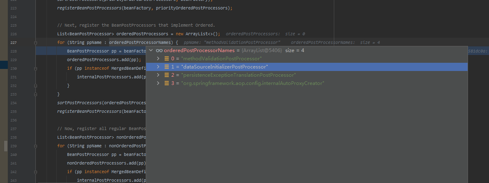

上一篇章研究了`factoryBean`的作用

这一篇开始研究`MapperFactoryBean`实例化过程



有意义的触发代码在`org.springframework.context.support.PostProcessorRegistrationDelegate#registerBeanPostProcessors(org.springframework.beans.factory.config.ConfigurableListableBeanFactory, org.springframework.context.support.AbstractApplicationContext)`

从截图上可知，当前有4个`ppName`。从结果可知。是第一个`ppName`触发的。

当然。如果想要研究这几个`ppName`是怎么产生的。

可以查看这个类`org.springframework.boot.autoconfigure.validation.ValidationAutoConfiguration#methodValidationPostProcessor`


这块正好是`spring boot`创建出来的一个`bean`
```java
	@Bean
	@ConditionalOnMissingBean
	public static MethodValidationPostProcessor methodValidationPostProcessor(
			Environment environment, @Lazy Validator validator) {
		MethodValidationPostProcessor processor = new MethodValidationPostProcessor();
		boolean proxyTargetClass = environment
				.getProperty("spring.aop.proxy-target-class", Boolean.class, true);
		processor.setProxyTargetClass(proxyTargetClass);
		processor.setValidator(validator);
		return processor;
	}

```

至于为什么会创建出这个`bean`。可以参考`探究springboot源码系列文章`。主要是与`spring-boot-autoconfigure-2.x.RELEASE.jar/META-INF/spring.factories` 中的配置有关


当这个`ppName`调用`beanFactory.getBean(ppName, BeanPostProcessor.class);`方法时。

有一步会拿到所有的`beanDefinitionNames`。判断是否是工厂`factoryBean`。

如果是的话就会进行实例化(因为`@MapperScan`会扫描`UserMapper`最终就会调用`org.mybatis.spring.mapper.MapperFactoryBean#MapperFactoryBean(java.lang.Class<T>)`)。


