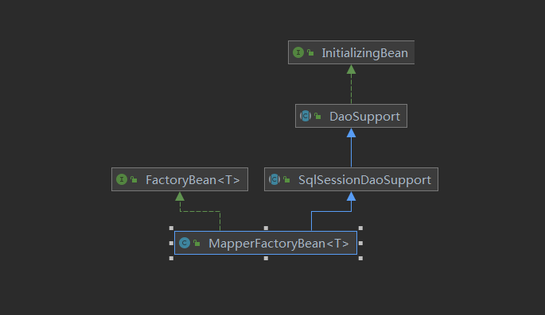

通过查看`MapperFactoryBean`的类结构图可以发现实现了`InitializingBean`接口。

`InitializingBean`接口信息如下：

```java

/**
 * Interface to be implemented by beans that need to react once all their properties
 * have been set by a {@link BeanFactory}: e.g. to perform custom initialization,
 * or merely to check that all mandatory properties have been set.
 *  
 * <p>An alternative to implementing {@code InitializingBean} is specifying a custom
 * init method, for example in an XML bean definition. For a list of all bean
 * lifecycle methods, see the {@link BeanFactory BeanFactory javadocs}.
public interface InitializingBean {

	/**
	 * Invoked by the containing {@code BeanFactory} after it has set all bean properties
	 * and satisfied {@link BeanFactoryAware}, {@code ApplicationContextAware} etc.
	 * <p>This method allows the bean instance to perform validation of its overall
	 * configuration and final initialization when all bean properties have been set.
	 * @throws Exception in the event of misconfiguration (such as failure to set an
	 * essential property) or if initialization fails for any other reason
	 */
	void afterPropertiesSet() throws Exception;

}

```

简而言之，这个接口有对`bean`属性创建好后，对`bean`的属性做一些操作

这里是`DaoSupport`实现了`InitializingBean`

`DaoSupport`抽象类对`jdbc`进行抽象

所以理所应当`afterPropertiesSet()`的具体实现规则可以由子类实现（`oracle`、`mysql`等）

```java
	@Override
	public final void afterPropertiesSet() {
		// Let abstract subclasses check their configuration.
		checkDaoConfig();
		// Let concrete implementations initialize themselves.
		initDao();
	}
```


`MapperFactoryBean`类初始化方法如下：

```java

  protected void checkDaoConfig() {
    super.checkDaoConfig(); //调用父类的检查方法，不重要
    Configuration configuration = getSqlSession().getConfiguration(); //获取到配置信息
    if (this.addToConfig && !configuration.hasMapper(this.mapperInterface)) {
      configuration.addMapper(this.mapperInterface); //将接口（userMapper），增加到configuration中去。
    }
  }

  public SqlSession getSqlSession() {
    return this.sqlSessionTemplate; //这里MapperFactoryBean 已经对属性进行注入
  }

```


`addMapper`方法如下：

```java
  public <T> void addMapper(Class<T> type) {
    if (type.isInterface()) { //必须是接口
        knownMappers.put(type, new MapperProxyFactory<>(type)); //这里将userMapper 放到knownMappers Map中 
        MapperAnnotationBuilder parser = new MapperAnnotationBuilder(config, type);
        /*
          这一步是对Mapper接口进行解析。
          解析接口方法，方法入参，返回值等      
         */
        parser.parse();
    }
  }
```

如果以后遇到`Mybaits`没有注册相应的接口，可以查看是否已经增加到`knownMappers`中


