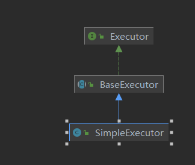
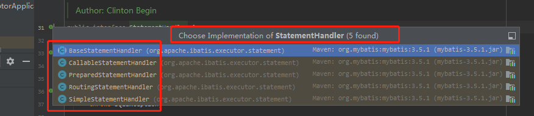
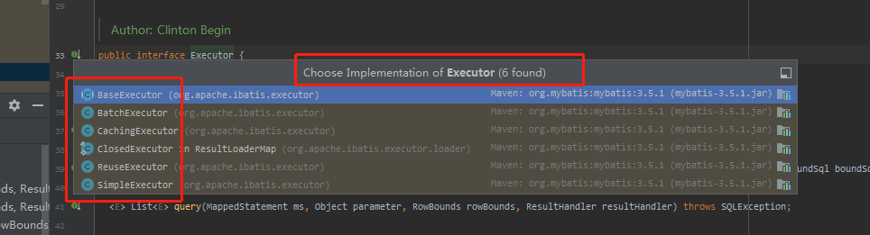

## 执行拦截器

通过7.1篇章的研究。我们发现7.1篇章只做了一个动作。就是获取session

```java
  private class SqlSessionInterceptor implements InvocationHandler {
    @Override
    public Object invoke(Object proxy, Method method, Object[] args) throws Throwable {
        //7.1篇章内容
      SqlSession sqlSession = getSqlSession(
          SqlSessionTemplate.this.sqlSessionFactory,
          SqlSessionTemplate.this.executorType,
          SqlSessionTemplate.this.exceptionTranslator);
        //这里实际还是调用org.apache.ibatis.session.defaults.DefaultSqlSession#selectOne(java.lang.String, java.lang.Object)
        Object result = method.invoke(sqlSession, args);
        return result;
    }
  }
```


```java
  public <T> T selectOne(String statement, Object parameter) {
    // Popular vote was to return null on 0 results and throw exception on too many.
    //实际上还是调用selectList方法。我们可以先看后面的流程
    //当list的size > 0 。那么就会报错。 也就是我们常见的异常（Expected one result (or null) to be returned by selectOne()）。    
    // 接着我们继续关注selectList方法。
    List<T> list = this.selectList(statement, parameter);
    if (list.size() == 1) {
      return list.get(0);
    } else if (list.size() > 1) {
      throw new TooManyResultsException("Expected one result (or null) to be returned by selectOne(), but found: " + list.size());
    } else {
      return null;
    }
  }

  @Override 
  public <E> List<E> selectList(String statement, Object parameter) {
     return this.selectList(statement, parameter, RowBounds.DEFAULT);
  }

  
  
  @Override
  public <E> List<E> selectList(String statement, Object parameter, RowBounds rowBounds) {
      //这里类似于用了dao 的接口 + 名称。 获取到MappedStatement缓存数据
      MappedStatement ms = configuration.getMappedStatement(statement);
      //wrapCollection(parameter) 看到名字就猜测到干嘛。 包装参数
      //executor我们通过7.1知道是CachingExecutor
      return executor.query(ms, wrapCollection(parameter), rowBounds, Executor.NO_RESULT_HANDLER);

  }
```

```java
//CachingExecutor类 
  public <E> List<E> query(MappedStatement ms, Object parameterObject, RowBounds rowBounds, ResultHandler resultHandler) throws SQLException {
    //获取原始SQL
    BoundSql boundSql = ms.getBoundSql(parameterObject);
    //缓存key 。应该是与mybatis一二级缓存相关  
    CacheKey key = createCacheKey(ms, parameterObject, rowBounds, boundSql);
    return query(ms, parameterObject, rowBounds, resultHandler, key, boundSql);
  }

  public <E> List<E> query(MappedStatement ms, Object parameterObject, RowBounds rowBounds, ResultHandler resultHandler, CacheKey key, BoundSql boundSql)
      throws SQLException {
    Cache cache = ms.getCache();
    if (cache != null) {
        //这里是关于cache是使用。 应该是同一个session中如果有缓存存在。并且usecache开关开了。那么就不会查询数据库
      flushCacheIfRequired(ms);
      if (ms.isUseCache() && resultHandler == null) {
        ensureNoOutParams(ms, boundSql);
        @SuppressWarnings("unchecked")
        List<E> list = (List<E>) tcm.getObject(cache, key);
        if (list == null) {
          list = delegate.query(ms, parameterObject, rowBounds, resultHandler, key, boundSql);
          tcm.putObject(cache, key, list); // issue #578 and #116
        }
        return list;
      }
    }
    //delegate = SimpleExecutor 忘记的同学看7.1 newExecutor方法  
    return delegate.query(ms, parameterObject, rowBounds, resultHandler, key, boundSql);
  }
```

查看`SimpleExecutor`继承结构和方法

Alt +7 查看当前类所有方法
Ctrl+H 查看类的继承关系




`SimpleExecutor` 只继承了`BaseExecutor`。而`query`方法`SimpleExecutor` 没有实现。是由父类`BaseExecutor`实现的

```java
//BaseExecutor
  public <E> List<E> query(MappedStatement ms, Object parameter, RowBounds rowBounds, ResultHandler resultHandler, CacheKey key, BoundSql boundSql) throws SQLException {
    List<E> list = queryFromDatabase(ms, parameter, rowBounds, resultHandler, key, boundSql);
    return list;
  }

  private <E> List<E> queryFromDatabase(MappedStatement ms, Object parameter, RowBounds rowBounds, ResultHandler resultHandler, CacheKey key, BoundSql boundSql) throws SQLException {
    //doQuery是抽象方法。由子类实现。 这里具体的子类是SimpleExecutor 
    List<E>  list = doQuery(ms, parameter, rowBounds, resultHandler, boundSql);
    return list;
  }

  protected abstract <E> List<E> doQuery(MappedStatement ms, Object parameter, RowBounds rowBounds, ResultHandler resultHandler, BoundSql boundSql)
      throws SQLException;
```


```java
 // SimpleExecutor 

  protected Executor wrapper;

  public <E> List<E> doQuery(MappedStatement ms, Object parameter, RowBounds rowBounds, ResultHandler resultHandler, BoundSql boundSql) throws SQLException {
      //获取配置信息、 我们没有对连接池进行特别处理。spring boot默认用的是HikariDataSource连接池
      Configuration configuration = ms.getConfiguration();
      //注意这里的wrapper是一个成员变量 。实际还是CachingExecutor
      StatementHandler handler = configuration.newStatementHandler(wrapper, ms, parameter, rowBounds, resultHandler, boundSql);
      //handler = RoutingStatementHandler代理对象
      //prepareStatement方法看 代码2 处
       Statement stmt = prepareStatement(handler, ms.getStatementLog());
      return handler.query(stmt, resultHandler);

  }
```


```java
//org.apache.ibatis.session.Configuration
  public StatementHandler newStatementHandler(Executor executor, MappedStatement mappedStatement, Object parameterObject, RowBounds rowBounds, ResultHandler resultHandler, BoundSql boundSql) {
    //statementHandler = RoutingStatementHandler
    StatementHandler statementHandler = new RoutingStatementHandler(executor, mappedStatement, parameterObject, rowBounds, resultHandler, boundSql);
    statementHandler = (StatementHandler) interceptorChain.pluginAll(statementHandler);
    return statementHandler;
  }

//注意实现了StatementHandler接口
public class RoutingStatementHandler implements StatementHandler {

  private final StatementHandler delegate;

  public RoutingStatementHandler(Executor executor, MappedStatement ms, Object parameter, RowBounds rowBounds, ResultHandler resultHandler, BoundSql boundSql) {
      //这里实例化了StatementHandler指向引用PreparedStatementHandler
	delegate = new PreparedStatementHandler(executor, ms, parameter, rowBounds, resultHandler, boundSql);
  }
```


```java
//org.apache.ibatis.plugin.InterceptorChain#pluginAll

  public Object pluginAll(Object target) {
      //interceptors 只有我们自定义的那一个（cn.withmes.springboot.mybatis.interceptor.config.ExecutorInterceptor）
    for (Interceptor interceptor : interceptors) {
       //入参target = RoutingStatementHandler
      target = interceptor.plugin(target);
      //由于 RoutingStatementHandler实现了StatementHandler接口。所以会返回一个代理对象。所以tart其实是一个RoutingStatementHandler的代理对象
    }
    return target;
  }

//cn.withmes.springboot.mybatis.interceptor.config.ExecutorInterceptor#plugin
    @Override
    public Object plugin(Object target) {
        return Plugin.wrap(target, this);
    }

  public static Object wrap(Object target, Interceptor interceptor) {
    Map<Class<?>, Set<Method>> signatureMap = getSignatureMap(interceptor);
     //type =   RoutingStatementHandler  
    Class<?> type = target.getClass();
    Class<?>[] interfaces = getAllInterfaces(type, signatureMap);
    //interfaces 返回一个元素 StatementHandler 。if判断能进去
    if (interfaces.length > 0) {
      //创建出一个代理。到时候会调用Plugin.invoke方法
      return Proxy.newProxyInstance(
          type.getClassLoader(),
          interfaces,
          new Plugin(target, interceptor, signatureMap));
    }
    return target;
  }

  private static Map<Class<?>, Set<Method>> getSignatureMap(Interceptor interceptor) {
    Intercepts interceptsAnnotation = interceptor.getClass().getAnnotation(Intercepts.class);
    Signature[] sigs = interceptsAnnotation.value();
    Map<Class<?>, Set<Method>> signatureMap = new HashMap<>();
    for (Signature sig : sigs) {
      Set<Method> methods = signatureMap.computeIfAbsent(sig.type(), k -> new HashSet<>());
      Method method = sig.type().getMethod(sig.method(), sig.args());
      methods.add(method);
    }
    //这里还是返回一个元素 = StatementHandler  这里和7.1篇章代码一样。详细解释请看7.1
    return signatureMap;
  }

  private static Class<?>[] getAllInterfaces(Class<?> type, Map<Class<?>, Set<Method>> signatureMap) {
    //type =   RoutingStatementHandler
    Set<Class<?>> interfaces = new HashSet<>();
    while (type != null) {
      for (Class<?> c : type.getInterfaces()) {
        //注意RoutingStatementHandler实现了StatementHandler。所以能进入if
        if (signatureMap.containsKey(c)) {
          //注意 c 是  RoutingStatementHandler的接口。不是RoutingStatementHandler。所以放到interfaces中的其实是接口
          interfaces.add(c);
        }
      }
      type = type.getSuperclass();
    }
    //返回一个元素 StatementHandler
    return interfaces.toArray(new Class<?>[interfaces.size()]);
  }


```


### 代码2 

```java
private Statement prepareStatement(StatementHandler handler, Log statementLog) throws SQLException {
  Statement stmt;
  //获取HikariDataSource
  Connection connection = getConnection(statementLog);
  //handler =   RoutingStatementHandler代理对象。会调用Plugin.invoke方法（org.apache.ibatis.plugin.Plugin#invoke）
  stmt = handler.prepare(connection, transaction.getTimeout());
  handler.parameterize(stmt);
  return stmt;
}
```


```java
//org.apache.ibatis.plugin.Plugin#invoke
public Object invoke(Object proxy, Method method, Object[] args) throws Throwable {
  try {
    Set<Method> methods = signatureMap.get(method.getDeclaringClass());
    if (methods != null && methods.contains(method)) {
      //这个interceptor是我们自定义的 = ExecutorInterceptor
      //绕了半天终于绕到了我们自定义的拦截器！
      return interceptor.intercept(new Invocation(target, method, args));
    }
    return method.invoke(target, args);
  } catch (Exception e) {
    throw ExceptionUtil.unwrapThrowable(e);
  }
}
```

我们再看一下`StatementHandler`的实现类

`PreparedStatementHandler`,`RoutingStatementHandler`,`SimpleStatementHandler`。这三个子类是我们在7.1-7.2篇章中遇到的



`Executor`子类

`BaseStatementHandler`,`CachingExecutor`,`SimpleExecutor`这三个子类是我们遇到的




### 总结

~~~mermaid
flowchart TD
    A[调用SqlSessionInterceptor#invoke方法] --> B(获取SqlSession)
    B --> C(继续调用原selectOne方法)
    C --> D(委托给SimpleExecutor)
    D --> a1(父类queryFromDatabase方法)
    subgraph ide1 [父类]
    a1-->a2(父类query方法)
    end
    a2-->E["SimpleExecutor(子类)创建一个StatementHandler(实际上是RoutingStatementHandler)"]
    E-->F["RoutingStatementHandler实现了StatementHandler"]
    F-->G["创建代理对象(调用Plugin.invoke)"]
    G-->H["调用自定义拦截器(ExecutorInterceptor)"]

~~~


