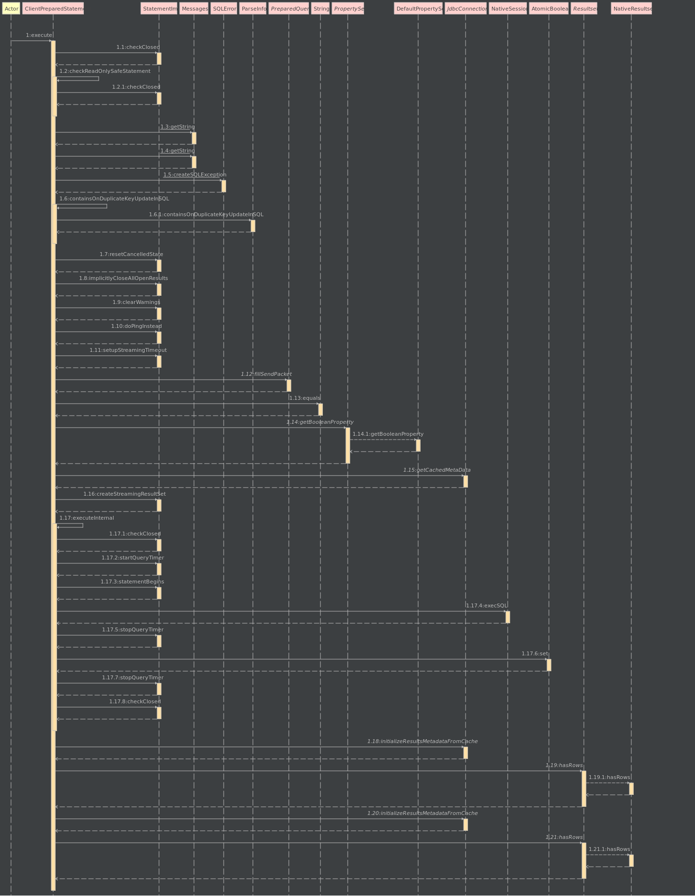

后面的查询相对来说抽象简单一点。

由于`springboot`默认使用的是`Hikari`连接池。 所以查询的话可能复杂一点。

但是通过`DEBUG`跟踪发现。其实`mybatis`连接`mysql`并非像网上那种方式（随便在网上找了一个例子 https://www.runoob.com/java/java-mysql-connect.html）

而是通过`BuffSocket`实现的(具体可查看`com.mysql.cj.jdbc.ClientPreparedStatement.execute`（但是后面发现这个类是属于`mysql-connector-java-8.0.16.jar`）)。

主要要看
` Message sendPacket = ((PreparedQuery<?>) this.query).fillSendPacket();`
.jpg)

这里可以发现。其实已经把我们的`SQL`转化成16进制了。IDEA通过转换，可以在右边的窗口看到我们的`SQL`

随后看`com.mysql.cj.protocol.a.SimplePacketSender.send`
.jpg)
虽然`packet`变量被转成byte了。但是我们通过`new String(packet)`发现还是对应着我们的`SQL`语句
（注意一点。1处的代码是`BuffSocket`对数据库的查询SQL进行操作的）

详细的调用图

**后续的结果无非是对结果集进行处理！**
