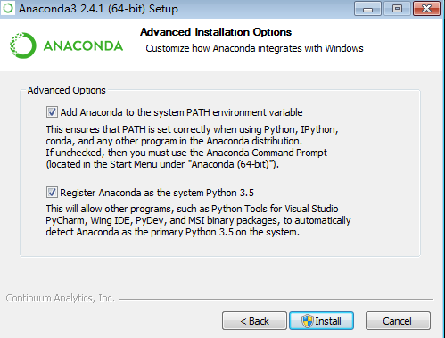
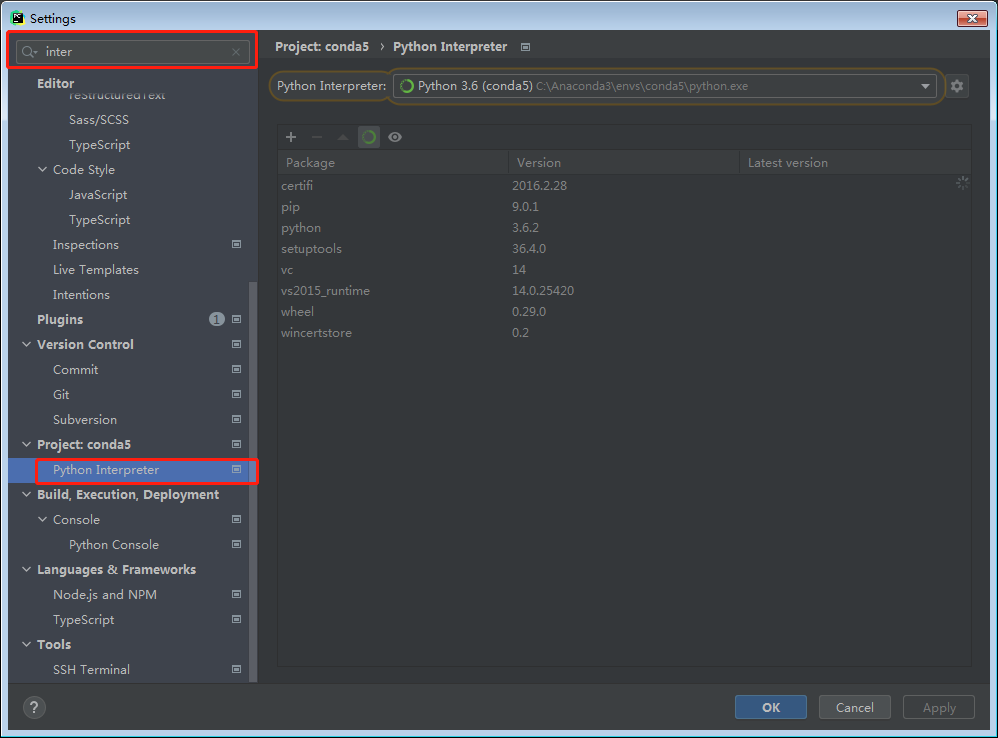
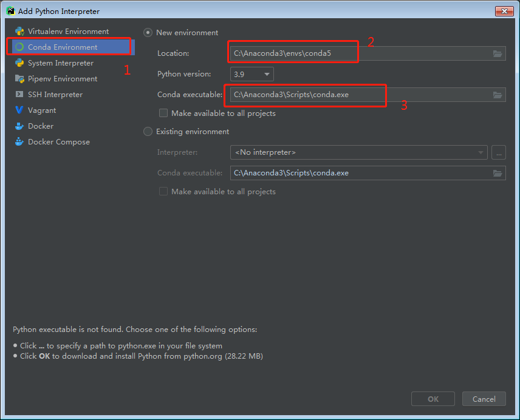

由于目前anaconda官网上都是要求win8以上的机器。所以win7只能用老版本的anaconda安装包。

## 下载安装anaconda

1. 下载

	下载地址：https://repo.anaconda.com/archive/ 
	在列表中搜索 `Anaconda3-2.4.1-Windows-x86_64.exe`进行下载。

2. 安装

   1. 建议都勾选上。其他的都默认就可以了
   
   
3. 测试
   1. 打开安装目录下的/Scripts/spyder.exe 双击运行
   2. 在spyder程序中 运行demo代码
```python
from skimage import io
img=io.imread('d:/dog.jpg') #换成你的图片
io.imshow(img)
```
   3. 正常的话会显示图片  
   4. 测试参考  https://blog.csdn.net/u011501388/article/details/76315085


## pycharm使用anaconda

1。修改anaconda国内镜像源 ，打开"C:\Users\用户名"目录，找到".condarc"文件，编辑它。

修改前：

```
channels:
  - https://mirrors.tuna.tsinghua.edu.cn/anaconda/pkgs/main/
  - https://mirrors.tuna.tsinghua.edu.cn/anaconda/pkgs/free/
  - defaults
ssl_verify: false
show_channel_urls: true
always_yes: false

```


修改后：

```
channels:
  - https://mirrors.ustc.edu.cn/anaconda/pkgs/free/
  - defaults
ssl_verify: false
show_channel_urls: true
always_yes: false
```

2。pycharm使用anaconda
	1.我的pycharm版本为PyCharm 2021.1.1 (Professional Edition)
	2.在任意pycharm编辑器中。打开setting ，搜索Interpreter
	
	3.点击右上角的小齿轮，选择Add
	4. 
		图中1处选择Conda Environment
		图中2处选择新的conda 环境
		图中3处选择的conda.exe(在安装目录下的Script中)
		
	5.等待一会儿就能使用conda环境了	

