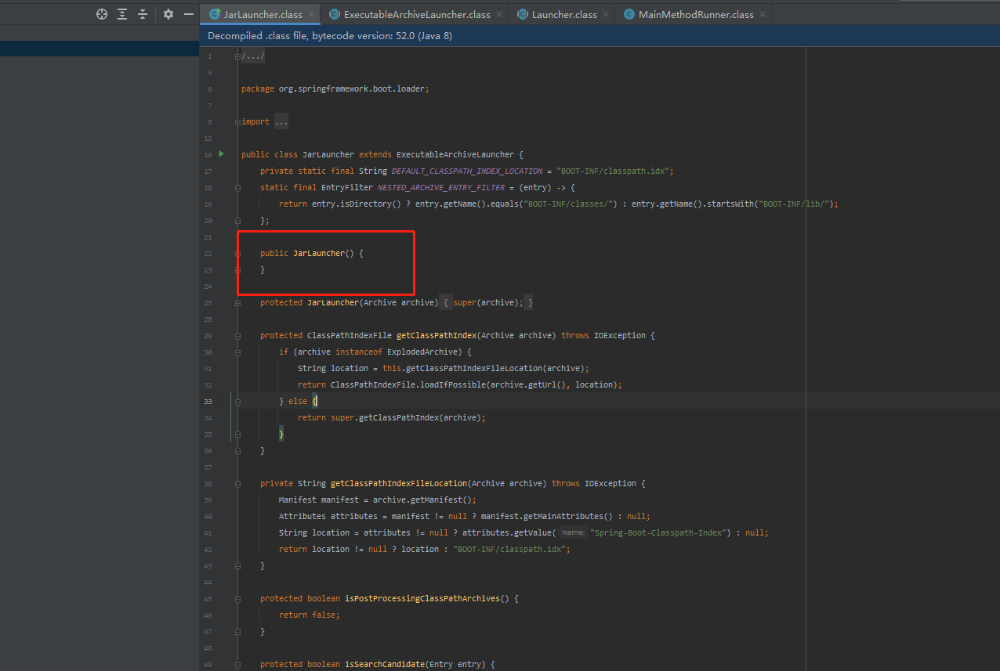

### 提出问题:

为什么`spring boot项目` 使用 `java -jar demo.jar` 可以直接启动?


### 环境依赖

| 工具 | 版本 |
| :-----:| :----: |
| 系统 | Win7 |
| IDEA | IntelliJ IDEA 2021.1 (Ultimate Edition)<br />Build #IU-211.6693.111, built on April 6, 2021 |
| JDK/JIRE | jdk1.8.0_191 |
| spring-boot | 2.5.3 |
| maven | maven-3.6.1 |

项目地址


### 分析过程

1. 下载demo项目后,使用maven `clean package` 进行打包,此处使用的是将spring-boot 依赖包都打包到一起(具体代码可参考`pom.xml` 文件 `<build>`节点)

2. 产生的target文件夹出现demo.jar包。用解压软件打开发现在`META-INF/MANIFEST.MF` (https://blog.csdn.net/chujia1956/article/details/100674230) 。内容如下：

```
Manifest-Version: 1.0
Spring-Boot-Classpath-Index: BOOT-INF/classpath.idx
Implementation-Title: demo
Implementation-Version: 0.0.1-SNAPSHOT
Spring-Boot-Layers-Index: BOOT-INF/layers.idx
Start-Class: com.example.demo.DemoApplication #此处是我们真实的main class
Spring-Boot-Classes: BOOT-INF/classes/
Spring-Boot-Lib: BOOT-INF/lib/
Build-Jdk-Spec: 1.8
Spring-Boot-Version: 2.5.3
Created-By: Maven Jar Plugin 3.2.0
Main-Class: org.springframework.boot.loader.JarLauncher #注意此处并非自定我们自定义的类
```

3. 在`BOOT-INF/lib/`文件夹中找到`org.springframework.boot.loader.JarLauncher`，使用IDEA工具打开

   

4. 在执行main方法前,会实例化对象,首先调用构造函数

   1. `new JarLauncher() -> new ExecutableArchiveLauncher()-> new Launcher()`   
   
   2. 在构造函数中,这里大概的意思是寻找文件所在的URI路径,实例化一个`Archive`对象(类似于jar包的路径和jar包信息) `org.springframework.boot.loader.Launcher#createArchive` 
   
```java 
        ProtectionDomain protectionDomain = this.getClass().getProtectionDomain();
        CodeSource codeSource = protectionDomain.getCodeSource();
        URI location = codeSource != null ? codeSource.getLocation().toURI() : null;
        String path = location != null ? location.getSchemeSpecificPart() : null;
        if (path == null) {
            throw new IllegalStateException("Unable to determine code source archive");
        } else {
            File root = new File(path);
            if (!root.exists()) {
                throw new IllegalStateException("Unable to determine code source archive from " + root);
            } else {
                return (Archive)(root.isDirectory() ? new ExplodedArchive(root) : new JarFileArchive(root));
            }
        }

```
      3. 随后调用`JarLauncher#main`方法,具体调用链如下`JarLauncher#main--> Launcher#launch(java.lang.String[])-->this.launch(args, launchClass, classLoader);--> this.createMainMethodRunner(launchClass, args, classLoader).run();-->MainMethodRunner#run`  ,在这里我们可以看到中调用`getMainClass() `中会获取到`MANIFEST.MF`中的`Start-Class`属性(也就是我们真实的启动类)

```java
    protected void launch(String[] args) throws Exception {
        if (!this.isExploded()) {
            JarFile.registerUrlProtocolHandler();
        }

        ClassLoader classLoader = this.createClassLoader(this.getClassPathArchivesIterator());
        String jarMode = System.getProperty("jarmode");
        String launchClass = jarMode != null && !jarMode.isEmpty() ? "org.springframework.boot.loader.jarmode.JarModeLauncher" : this.getMainClass();
        this.launch(args, launchClass, classLoader);
    }

    protected String getMainClass() throws Exception {
        Manifest manifest = this.archive.getManifest();
        String mainClass = null;
        if (manifest != null) {
            mainClass = manifest.getMainAttributes().getValue("Start-Class");   
        }

        if (mainClass == null) {
            throw new IllegalStateException("No 'Start-Class' manifest entry specified in " + this);
        } else {
            return mainClass;
        }
    }


    public void run() throws Exception {
        Class<?> mainClass = Class.forName(this.mainClassName, false, Thread.currentThread().getContextClassLoader());
        Method mainMethod = mainClass.getDeclaredMethod("main", String[].class);
        mainMethod.setAccessible(true);
        mainMethod.invoke((Object)null, this.args);
    }    
    }
        
```


### 总结:

​	`springboot` 项目当使用`maven`工具打包后,会生成对应的jar包。

​	jar包内的`MANIFEST.MF`文件, `Main-Class`属性对应的启动类是`org.springframework.boot.loader.JarLauncher` 。在调用JarLauncher#main方法后。会找到对应的ClassLoader以及 真实的启动类(`Start-Class`控制)。通过反射调用`Start-Class`对应的类的`main`方法

