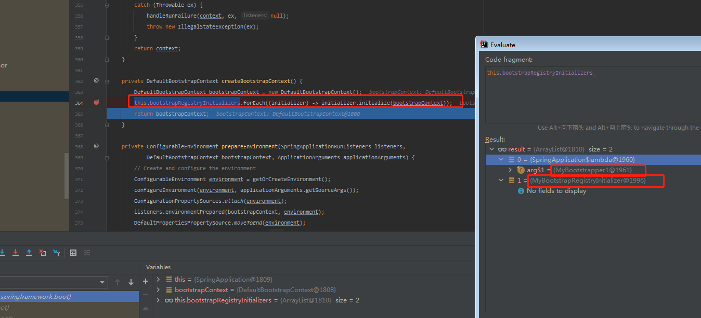

# SpringApplication.run做了什么?

## 构造函数

在`SpringApplication.run`调用后,我们跟着源码的脚步。发现首先第一件事是调用重载的构造函数`new SpringApplication(primarySources);`

删除一些无用代码保留主线

```java
public SpringApplication(ResourceLoader resourceLoader, Class<?>... primarySources) {
   this.webApplicationType = WebApplicationType.deduceFromClasspath(); //推断应用类型  WEB容器,REACTIVE,非嵌入式(也就是普通的容器)  这里pom.xml 没有应用web相关的依赖包 所以是普通容器 。判断也比较简单 根据反射类名
   this.bootstrapRegistryInitializers = getBootstrapRegistryInitializersFromSpringFactories(); //获取Bootstrapper 对应的实现类。因为是spring boot的项目。所以会默认的到META-INF/spring.factories文件中去寻找
   setInitializers((Collection) getSpringFactoriesInstances(ApplicationContextInitializer.class));
   setListeners((Collection) getSpringFactoriesInstances(ApplicationListener.class));
    //推断main Class,这里推断的结果是com.example.demo.DemoApplication .通过栈的方法名 是否包含main 判断
   this.mainApplicationClass = deduceMainApplicationClass();
}

	private List<BootstrapRegistryInitializer> getBootstrapRegistryInitializersFromSpringFactories() {
		ArrayList<BootstrapRegistryInitializer> initializers = new ArrayList<>();
		getSpringFactoriesInstances(Bootstrapper.class).stream()
				.map((bootstrapper) -> ((BootstrapRegistryInitializer) bootstrapper::initialize))
				.forEach(initializers::add); // getSpringFactoriesInstances() 最终调用 loadSpringFactories()
		initializers.addAll(getSpringFactoriesInstances(BootstrapRegistryInitializer.class));
		return initializers;
	}


	private static Map<String, List<String>> loadSpringFactories(ClassLoader classLoader) {
		Map<String, List<String>> result = new HashMap<>();
        Enumeration<URL> urls = classLoader.getResources(FACTORIES_RESOURCE_LOCATION);
        while (urls.hasMoreElements()) {
            URL url = urls.nextElement();
            UrlResource resource = new UrlResource(url);
            Properties properties = PropertiesLoaderUtils.loadProperties(resource);
            for (Map.Entry<?, ?> entry : properties.entrySet()) {
                String factoryTypeName = ((String) entry.getKey()).trim();
                //这里通过类名 去META-INFO/spring.factories寻找文件，如果找到了。那么就会加入到result集合中
                String[] factoryImplementationNames =
                    StringUtils.commaDelimitedListToStringArray((String) entry.getValue());
                for (String factoryImplementationName : factoryImplementationNames) {
                    result.computeIfAbsent(factoryTypeName, key -> new ArrayList<>())
                        .add(factoryImplementationName.trim());
                }
            }
        }
       
        result.replaceAll((factoryType, implementations) -> implementations.stream().distinct()
                          .collect(Collectors.collectingAndThen(Collectors.toList(), 
                                                                 //这里构建了不可变list
                                                                Collections::unmodifiableList)));
		}
		return result;
	}


```

## 总结

从源码可以看出.在构造函数中。`spring boot`主要做了两件事情

1. 推断应用类型
2. 加载 `META-INF/spring.factories`内容。不过需要注意的是，在读取`META-INF/spring.factories`文件内容时，`spring-boot-2.5.3.jar/META-INF/spring.factories`文件同样会加载进来
3. 会把`Bootstrapper.class`和`BootstrapRegistryInitializer.class`实现类放到`this.bootstrapRegistryInitializers `容器中
4. 会把`ApplicationContextInitializer.class`,`ApplicationListener.class`放到`this.initializers`容器中
5.  **问题**
```java
getSpringFactoriesInstances(Bootstrapper.class).stream()
				.map((bootstrapper) -> ((BootstrapRegistryInitializer) bootstrapper::initialize))
				.forEach(initializers::add);
这块使用.map 调用bootstrapper::initialize,但是MyBootstrapper1#initialize却没有执行，而是后面才执行!
```


# RUN函数做了什么?

### 具体方法分析

1. #### 下面将根据`run`方法里面的具体功能做具体分析

```java
	/**
	运行一个spring应用.创建和刷新一个新的应用上下文  ,此时注意返回的是 ConfigurableApplicationContext
	Run the Spring application, creating and refreshing a new ApplicationContext.
	*/
	public ConfigurableApplicationContext run(String... args) {
		DefaultBootstrapContext bootstrapContext = createBootstrapContext(); //1.创建默认的DefaultBootstrapContext,此时会调用this.bootstrapRegistryInitializers的initialize方法.如下图1所示。此时我们注入了两个  所以会依次调用
		ConfigurableApplicationContext context = null;
		SpringApplicationRunListeners listeners = getRunListeners(args); // 2.这里会把定义中META-INF/spring.factories  org.springframework.boot.SpringApplicationRunListener 的实现类实例化取出来
		listeners.starting(bootstrapContext, this.mainApplicationClass);
			ApplicationArguments applicationArguments = new DefaultApplicationArguments(args);
			ConfigurableEnvironment environment = prepareEnvironment(listeners, bootstrapContext, applicationArguments);
			configureIgnoreBeanInfo(environment);
			Banner printedBanner = printBanner(environment);
			context = createApplicationContext();
			context.setApplicationStartup(this.applicationStartup);
			prepareContext(bootstrapContext, context, environment, listeners, applicationArguments, printedBanner);
			refreshContext(context);
			afterRefresh(context, applicationArguments);
			if (this.logStartupInfo) {
				new StartupInfoLogger(this.mainApplicationClass).logStarted(getApplicationLog(), stopWatch);
			}
			listeners.started(context);
			callRunners(context, applicationArguments);
		}
		listeners.running(context);
		return context;
	}


```




==图1==

------


2.`org.springframework.boot.SpringApplication#getRunListeners`  

```java
	
private SpringApplicationRunListeners getRunListeners(String[] args) {
	Class<?>[] types = new Class<?>[] { SpringApplication.class, String[].class }; //注意这里
		return new SpringApplicationRunListeners(logger,
				getSpringFactoriesInstances(SpringApplicationRunListener.class, types, this, args),
				this.applicationStartup);
	}
这块的代码依旧是根据名称去 META-INF/spring.factories 寻找实现类。
此时想着需要实例化对象，那么肯定会调用构造方法。
于是写了一个一个空的构造方法 。结果直接报错 

Caused by: java.lang.NoSuchMethodException: com.example.demo.MySpringApplicationRunListener.<init>(org.springframework.boot.SpringApplication, [Ljava.lang.String;)

由于当时我没有注意到上面那段代码增加了两个参数的构造函数。 正确的姿势是
增加一个org.springframework.boot.SpringApplication 和 java.lang.String [] 的构造参数
    public MySpringApplicationRunListener(org.springframework.boot.SpringApplication application, java.lang.String [] str) {
        System.out.println("MySpringApplicationRunListener 构造函数");
    }
    这样就不会报错了。

科普一下
[Ljava.lang.String;@4554617c
“[” 表示一维数组
"[["表示二维数组
"L"表示一个对象
"java.lang.String"表示对象的类型
"@"后面表示该对象的HashCode

```

#### 总结2：

​	根据名称去` META-INF/spring.factories `寻找实现类。并生成带`org.springframework.boot.SpringApplication application, java.lang.String [] str`的构造函数。


3. `listeners.starting(bootstrapContext, this.mainApplicationClass);` 。从代码中我们可以看出，最终是调用 ·doWithListeners·方法。可以看到第二个参数是`Consumer`类型。`Consumer`类型接受参数，没有返回值  。在'doWithListeners'方法中的第二个参数`listenerAction`实际上是调用了 `listener.starting` 。也就是我们之前实现了`org.springframework.boot.SpringApplicationRunListener`

   

```java
1.
	void starting(ConfigurableBootstrapContext bootstrapContext, Class<?> mainApplicationClass) {
		doWithListeners("spring.boot.application.starting", (listener) -> listener.starting(bootstrapContext),
				(step) -> {
					if (mainApplicationClass != null) {
						step.tag("mainApplicationClass", mainApplicationClass.getName());
					}
				});
	}
2.
	private void doWithListeners(String stepName, Consumer<SpringApplicationRunListener> listenerAction,
			Consumer<StartupStep> stepAction) {
		StartupStep step = this.applicationStartup.start(stepName);
		this.listeners.forEach(listenerAction);
		if (stepAction != null) {
			stepAction.accept(step);
		}
		step.end();
	}				

```


#### 总结3：

​	1.调用实现类`org.springframework.boot.SpringApplicationRunListener#starting`

**问题：**`而第三个参数是接受Consumer<StartupStep> `入参。没有指定`StartupStep`具体类型。但是通过DEBUG却能知道是`DefaultApplicationStartup$DefaultStartupStep`。这里有点匪夷所思！

**#2022-08-23解答**

1.因为在`doWithListeners()`方法的时候通过` this.applicationStartup.start(stepName);`确定`StartupStep`

