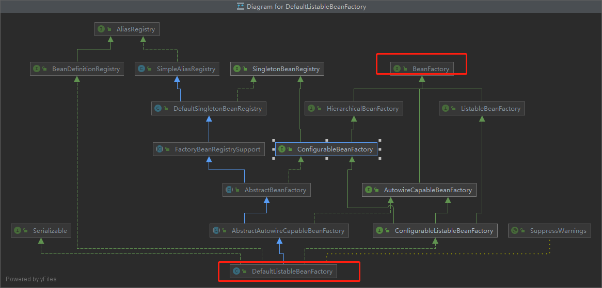
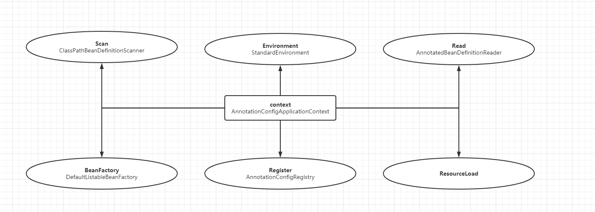

**文章内容如有错误,请提出**

此篇,将探究`spring bean` 工厂以及相关的重要组成类

我们可能已经在网上知道了`spring bean` 工厂以及相关的组成类 有这些  `BeanFactory`、`ApplicationContext` 、` BeanDefinitionRegistry` `EnvironmentCapable` 、`xxxBeanDefinitionReader` 、  `ResourceLoader(xxBeanDefinitionScanner)` 、`BeanDefinitionHolder`。但是却不知道他们之间的关系以及各个类的作用

在此篇中。我们将逐步探索以及spring(spring-boot)相关的面试题:

1. `BeanFactory` 和`ApplicationContext`,`ListableBeanFactory`,`HierarchicalBeanFactory`有什么区别? 
2. `spring-boot` 使用了哪些设计模式?
3. 为什么可以使用`@Component`,`@Controller`,`@Service`注解?他们如何生效,以及在什么时候加载的?


------

### 实例化context

再上一篇中，我们知道spring-boot 会去加载META-info/文件夹下面的文件，找到对应的实现类 。后续再进行调用

再这一篇章中，我们主要关注context是怎么创建出来的

`run`方法如下：

```java
	public ConfigurableApplicationContext run(String... args) {
		StopWatch stopWatch = new StopWatch();
		stopWatch.start();
		DefaultBootstrapContext bootstrapContext = createBootstrapContext();
		ConfigurableApplicationContext context = null;
		configureHeadlessProperty();
		SpringApplicationRunListeners listeners = getRunListeners(args);
		listeners.starting(bootstrapContext, this.mainApplicationClass);
		try {
			ApplicationArguments applicationArguments = new DefaultApplicationArguments(args);
			ConfigurableEnvironment environment = prepareEnvironment(listeners, bootstrapContext, applicationArguments);
			configureIgnoreBeanInfo(environment);
			Banner printedBanner = printBanner(environment);
            //关注createApplicationContext
			context = createApplicationContext();
			context.setApplicationStartup(this.applicationStartup);
			prepareContext(bootstrapContext, context, environment, listeners, applicationArguments, printedBanner);
			refreshContext(context);
			afterRefresh(context, applicationArguments);
			stopWatch.stop();
			if (this.logStartupInfo) {
				new StartupInfoLogger(this.mainApplicationClass).logStarted(getApplicationLog(), stopWatch);
			}
			listeners.started(context);
			callRunners(context, applicationArguments);
		}
		catch (Throwable ex) {
			handleRunFailure(context, ex, listeners);
			throw new IllegalStateException(ex);
		}

		return context;
	}
```


话不多说,直接看到`org.springframework.boot.SpringApplication#createApplicationContext`方法。

注释大概意思是  使用==**策略模式**==/方法(`Strategy method `)创建一个==`ApplicationContext`== ,在`ApplicationContextFactory`的`created`方法中实际是返回的`ConfigurableApplicationContext` 。从字面意思可以看到创建出来的`applicationContext`有配置能力

```java

	/**
	 * Strategy method used to create the {@link ApplicationContext}. By default this
	 * method will respect any explicitly set application context class or factory before
	 * falling back to a suitable default.
	 * @return the application context (not yet refreshed)
	 * @see #setApplicationContextClass(Class)
	 * @see #setApplicationContextFactory(ApplicationContextFactory)
	 */
	protected ConfigurableApplicationContext createApplicationContext() {
		return this.applicationContextFactory.create(this.webApplicationType);
	}

	private ApplicationContextFactory applicationContextFactory = ApplicationContextFactory.DEFAULT;


@FunctionalInterface
public interface ApplicationContextFactory {

	/**
	 * A default {@link ApplicationContextFactory} implementation that will create an
	 * appropriate context for the {@link WebApplicationType}.
	 */
	ApplicationContextFactory DEFAULT = (webApplicationType) -> {
		try {
			switch (webApplicationType) {
			case SERVLET:
				return new AnnotationConfigServletWebServerApplicationContext();
			case REACTIVE:
				return new AnnotationConfigReactiveWebServerApplicationContext();
			default:
                    //默认走的default分支
				return new AnnotationConfigApplicationContext();
			}
		}
		catch (Exception ex) {
			throw new IllegalStateException("Unable create a default ApplicationContext instance, "
					+ "you may need a custom ApplicationContextFactory", ex);
		}
	};
    
    
	/**
	 * Creates the {@link ConfigurableApplicationContext application context} for a
	 * {@link SpringApplication}, respecting the given {@code webApplicationType}.
	 * @param webApplicationType the web application type
	 * @return the newly created application context
	 */
	ConfigurableApplicationContext create(WebApplicationType webApplicationType);
}
```


具体`ConfigurableApplicationContext`有什么配置能力?以及和`ApplicationContext`有什么区别?

```java

package org.springframework.context;

/**
 * SPI interface to be implemented by most if not all application contexts.
 * Provides facilities to configure an application context in addition
 * to the application context client methods in the
 * {@link org.springframework.context.ApplicationContext} interface.
 *
 * <p>Configuration and lifecycle methods are encapsulated here to avoid
 * making them obvious to ApplicationContext client code. The present
 * methods should only be used by startup and shutdown code.
 *
 * @author Juergen Hoeller
 * @author Chris Beams
 * @author Sam Brannen
 * @since 03.11.2003
 */
public interface ConfigurableApplicationContext extends ApplicationContext, Lifecycle, Closeable {

	/**
	 * Any number of these characters are considered delimiters between
	 * multiple context config paths in a single String value.
	 * @see org.springframework.context.support.AbstractXmlApplicationContext#setConfigLocation
	 * @see org.springframework.web.context.ContextLoader#CONFIG_LOCATION_PARAM
	 * @see org.springframework.web.servlet.FrameworkServlet#setContextConfigLocation
	 */
	String CONFIG_LOCATION_DELIMITERS = ",; \t\n";

	/**
	 * Name of the ConversionService bean in the factory.
	 * If none is supplied, default conversion rules apply.
	 * @since 3.0
	 * @see org.springframework.core.convert.ConversionService
	 */
	String CONVERSION_SERVICE_BEAN_NAME = "conversionService";

	/**
	 * Name of the LoadTimeWeaver bean in the factory. If such a bean is supplied,
	 * the context will use a temporary ClassLoader for type matching, in order
	 * to allow the LoadTimeWeaver to process all actual bean classes.
	 * @since 2.5
	 * @see org.springframework.instrument.classloading.LoadTimeWeaver
	 */
	String LOAD_TIME_WEAVER_BEAN_NAME = "loadTimeWeaver";

	/**
	 * Name of the {@link Environment} bean in the factory.
	 * @since 3.1
	 */
	String ENVIRONMENT_BEAN_NAME = "environment";

	/**
	 * Name of the System properties bean in the factory.
	 * @see java.lang.System#getProperties()
	 */
	String SYSTEM_PROPERTIES_BEAN_NAME = "systemProperties";

	/**
	 * Name of the System environment bean in the factory.
	 * @see java.lang.System#getenv()
	 */
	String SYSTEM_ENVIRONMENT_BEAN_NAME = "systemEnvironment";

	/**
	 * Name of the {@link ApplicationStartup} bean in the factory.
	 * @since 5.3
	 */
	String APPLICATION_STARTUP_BEAN_NAME = "applicationStartup";

	/**
	 * {@link Thread#getName() Name} of the {@linkplain #registerShutdownHook()
	 * shutdown hook} thread: {@value}.
	 * @since 5.2
	 * @see #registerShutdownHook()
	 */
	String SHUTDOWN_HOOK_THREAD_NAME = "SpringContextShutdownHook";


	/**
	 * Determine whether this application context is active, that is,
	 * whether it has been refreshed at least once and has not been closed yet.
	 * @return whether the context is still active
	 * @see #refresh()
	 * @see #close()
	 * @see #getBeanFactory()
	 */
	boolean isActive();

	/**
	 * Return the internal bean factory of this application context.
	 * Can be used to access specific functionality of the underlying factory.
	 返回此应用程序上下文的内部 bean 工厂。 可用于访问底层工厂的特定功能。
	 * <p>Note: Do not use this to post-process the bean factory; singletons
	 * will already have been instantiated before. Use a BeanFactoryPostProcessor
	 * to intercept the BeanFactory setup process before beans get touched.
	 注意：不要用它来对 bean factory 进行后处理； 单例之前已经被实例化了。 使用 BeanFactoryPostProcessor 在 bean 被接触之前拦截 BeanFactory 设置过程。
	 * <p>Generally, this internal factory will only be accessible while the context
	 * is active, that is, in-between {@link #refresh()} and {@link #close()}.
	 * The {@link #isActive()} flag can be used to check whether the context
	 * is in an appropriate state.
	 通常，只有在上下文处于活动状态时，即在 refresh() 和 close() 之间，才能访问此内部工厂。 isActive() 标志可用于检查上下文是否处于适当的状态。
	 * @return the underlying bean factory
	 * @throws IllegalStateException if the context does not hold an internal
	 * bean factory (usually if {@link #refresh()} hasn't been called yet or
	 * if {@link #close()} has already been called)
	 * @see #isActive()
	 * @see #refresh()
	 * @see #close()
	 * @see #addBeanFactoryPostProcessor
	 */
	ConfigurableListableBeanFactory getBeanFactory() throws IllegalStateException;

}

```


### 实例化AnnotationConfigApplicationContext

`ConfigurableApplicationContext`类中,可以通过`getBeanFactory()`获得一个`ConfigurableListableBeanFactory`的工厂。这是`ApplicationContext`不具备的。而且可以在接口中看到很多常量。


回到前面策略模式创建`ConfigurableApplicationContext`的地方。从前面的流程跟下来，得知`webApplicationType = NONE` ,所以返回的是`AnnotationConfigApplicationContext`。通过`AnnotationConfigApplicationContext`类结构信息。可以看到继承了`GenericApplicationContext（Generic 通常的，一般的 通过名字大概可以猜出这是一个基类）`以及实现了`AnnotationConfigRegistry`。 


```java
public class AnnotationConfigApplicationContext extends GenericApplicationContext implements AnnotationConfigRegistry {

	private final AnnotatedBeanDefinitionReader reader;

	private final ClassPathBeanDefinitionScanner scanner;


	/**
	 * Create a new AnnotationConfigApplicationContext that needs to be populated
	 * through {@link #register} calls and then manually {@linkplain #refresh refreshed}.
	 */
	public AnnotationConfigApplicationContext() {
		StartupStep createAnnotatedBeanDefReader = this.getApplicationStartup().start("spring.context.annotated-bean-reader.create");
		this.reader = new AnnotatedBeanDefinitionReader(this);
		createAnnotatedBeanDefReader.end();
		this.scanner = new ClassPathBeanDefinitionScanner(this);
	}
}

public class GenericApplicationContext extends AbstractApplicationContext implements BeanDefinitionRegistry {

	private final DefaultListableBeanFactory beanFactory;

	@Nullable
	private ResourceLoader resourceLoader;

	private boolean customClassLoader = false;

	private final AtomicBoolean refreshed = new AtomicBoolean();


	/**
	 * Create a new GenericApplicationContext.
	 * @see #registerBeanDefinition
	 * @see #refresh
	 */
	public GenericApplicationContext() {
		this.beanFactory = new DefaultListableBeanFactory();
	}
}

```

`AnnotationConfigApplicationContext`还有`AnnotatedBeanDefinitionReader（从名字来看是负责读）`,`ClassPathBeanDefinitionScanner（从名字来看是负责扫描）`属性。

此刻我们可以猜想。context 有了扫描 ->扫描到文件->读取配置（可能是读注解（spring 新版/spring boot），也有可能是读xml（spring老版））->注册？

估计还会有一个注册相关的东东(读到一些东西，总要找个地方存起来吧？)。

目前只看到`AnnotationConfigApplicationContext`实现了`AnnotationConfigRegistry`

此处`spring-boot`用了设计理念 **[少用继承 多用组合的设计模式](https://blog.csdn.net/w1012747007/article/details/75331166)**

### 实例化GenericApplicationContext

java语言的设计让我们知道.如果要实例化一个子类。首先要在实例化其父类。如果没有指定实例化哪个父类的构造函数。默认调用父类的无参构造函数。

所以在调用`new AnnotationConfigApplicationContext()`(实例化) 之前，会先调用`new GenericApplicationContext()`


在`GenericApplicationContext`构造函数中。又实例化了`DefaultListableBeanFactory`对象。但是通过类图的继承关系可以看到。`DefaultListableBeanFactory`是`BeanFactory`的实现类。那`spring`团队为什么不用这种形式呢?

```java
BeanFactory beanFactory =new DefaultListableBeanFactory()
```

可能的一种解释是`GenericApplicationContext`的子类比较多。如果使用`BeanFactory beanFactory`的形式，那么子类都需要自己去判断类型和强转！


回到`AnnotationConfigApplicationContext`构造函数。可以看到主要是做了两件事情。

1、实例化`Reader`

2、实例化`Scanner`

```java
		StartupStep createAnnotatedBeanDefReader = this.getApplicationStartup().start("spring.context.annotated-bean-reader.create");
		this.reader = new AnnotatedBeanDefinitionReader(this);// 这里代码比较短.this.reader 类型是  org.springframework.core.env.StandardEnvironment   Standard 标准的
		createAnnotatedBeanDefReader.end();
		this.scanner = new ClassPathBeanDefinitionScanner(this); //classpath 方式的扫描器

```


```java

	/**
	 * Create a new {@code ClassPathBeanDefinitionScanner} for the given bean factory.
	 * @param registry the {@code BeanFactory} to load bean definitions into, in the form
	 * of a {@code BeanDefinitionRegistry}
	 为给定的 bean 工厂创建一个新的 ClassPathBeanDefinitionScanner。
    参数：
    registry – 以 BeanDefinitionRegistry 的形式加载 bean 定义的 BeanFactory
	 */
	public ClassPathBeanDefinitionScanner(BeanDefinitionRegistry registry) {
		this(registry, true);
	}
```

现在我们关注`new ClassPathBeanDefinitionScanner(this);` 从构造函数的注释可知。其实根据谷歌翻译根本不知道说的什么玩意


```java
A bean definition scanner that detects bean candidates on the classpath, registering corresponding bean definitions with a given registry (BeanFactory or ApplicationContext).
Candidate classes are detected through configurable type filters. The default filters include classes that are annotated with Spring's @Component, @Repository, @Service, or @Controller stereotype.
Also supports Java EE 6's javax.annotation.ManagedBean and JSR-330's javax.inject.Named annotations, if available.

```

看下类的注释吧，这意思不就是说扫描这些带了 `@Component, @Repository, @Service, or @Controller stereotype.`元注解的信息吗？

那这样就好懂了，接着往下看吧

在构造方法后，经过层层包装，经过抽丝剥茧，找到了终于干活的方法

```java

	/**
	 * Register the default filter for {@link Component @Component}.
	 * <p>This will implicitly register all annotations that have the
	 * {@link Component @Component} meta-annotation including the
	 * {@link Repository @Repository}, {@link Service @Service}, and
	 * {@link Controller @Controller} stereotype annotations.
	 * <p>Also supports Java EE 6's {@link javax.annotation.ManagedBean} and
	 * JSR-330's {@link javax.inject.Named} annotations, if available.
	 *
	 */
	@SuppressWarnings("unchecked")
	protected void registerDefaultFilters() {
        //注意这条
		this.includeFilters.add(new AnnotationTypeFilter(Component.class));
		ClassLoader cl = ClassPathScanningCandidateComponentProvider.class.getClassLoader();
		
        this.includeFilters.add(new AnnotationTypeFilter(
            ((Class<? extends Annotation>) ClassUtils.forName("javax.annotation.ManagedBean", cl)), false));
        logger.trace("JSR-250 'javax.annotation.ManagedBean' found and supported for component scanning");
		
		this.includeFilters.add(new AnnotationTypeFilter(
					((Class<? extends Annotation>) ClassUtils.forName("javax.inject.Named", cl)), false));
			logger.trace("JSR-330 'javax.inject.Named' annotation found and supported for component scanning");
	}

```

看着注释，感觉已经把答案告诉我们了。。。

注册一个默认的`@Component`过滤器。这样会隐式注册所有具有 `@Component `元注释的注释，包括` @Repository、@Service 和 @Controller` 构造型注释

贴一个`@Service`的类信息,不过不确定为什么会这样（因为我没验证过，百度是这样说的），获取因为在`Service`元注解上又标记了`@Component`的原因

`@AliasFor`参考 https://blog.csdn.net/weixin_43564627/article/details/93871075

```java
@Target({ElementType.TYPE})
@Retention(RetentionPolicy.RUNTIME)
@Documented
@Component
public @interface Service {

	/**
	 * The value may indicate a suggestion for a logical component name,
	 * to be turned into a Spring bean in case of an autodetected component.
	 * @return the suggested component name, if any (or empty String otherwise)
	 */
	@AliasFor(annotation = Component.class)
	String value() default "";

}

```


### 总结1

​	通过实例化`context`,我们知道`spring-boot`实例化了`AnnotationConfigApplicationContext`,

​	而`AnnotationConfigApplicationContext`的父类`GenericApplicationContext`又实例化了`DefaultListableBeanFactory`属性(从而具备了 beanFactory能力)

​	并且`BeanDefinitionRegistry`又实现了接口`BeanDefinitionRegistry` 

​	当然也实例化了`Reader(org.springframework.core.env.StandardEnvironment);`和`Scanner(ClassPathBeanDefinitionScanner)`

​	现在等同于`context`拥有了 ``BeanDefinition`查找的能力(因为`Scanner`)。也拥有了'BeanFactory'能力

​	现在想想`context`的翻译过来是什么意思呢? 上下文?那为什么要交上下文呢,那不就是承上启下的作用呗。

​    比如我们读到`你好漂亮`

​    但是我们不知道这句话在什么场景下产生的,

​	如果是一个流氓大晚上的对一个女生说和男朋友在大晚上和心爱的女生说结论完全不同

​	所以我们需要上下文来读懂整个语句的意思

​	同样。`spring`的的体系也是如此。给一个`context`。但是`context`组合了多种元素

​	就好比。我们人都是有两支手，两只脚等其他身体部件组成的。`context`就好比心脏。只要提供好这些部件。能够给`context`使用就行。至于你是黑色的手还是白色的手。那是不同的`context`组装出来的人。

​	所以就回到了我们学习`spring`的时候,我们知道`spring context`有`FileSystemXmlApplicationContext、ClassPathXmlApplicationContext、AnnotationConfigApplicationContext`。而这些不同的`context`里面拥有不同的`Read、Scan`等等


### 	准备Context(prepareContext)

在实例化了context以及填充了一些context属性后,`spring boot` 随后调用了`prepareContext`。通过方法名可以猜测是准备上下文。

```java
	private void prepareContext(DefaultBootstrapContext bootstrapContext, ConfigurableApplicationContext context,
			ConfigurableEnvironment environment, SpringApplicationRunListeners listeners,
			ApplicationArguments applicationArguments, Banner printedBanner) {
        // 设置环境 在prepareEnvironment(listeners, bootstrapContext, applicationArguments); 方法中已经是返回 ApplicationEnvironment
		context.setEnvironment(environment);
        //设置了转换服务 .应该是与类里面的某些属性有关  org.springframework.core.env.MutablePropertySources
		postProcessApplicationContext(context);
        //如果实现了org.springframework.context.ApplicationContextInitializer .那么会调用initialize
		applyInitializers(context);
        //循环调用  SpringApplicationRunListener.contextPrepared(context)
		listeners.contextPrepared(context);
        //发送一个event 通知bootstrapContext已关闭了 
		bootstrapContext.close(context);
        //打印日志,无关紧要
		if (this.logStartupInfo) {
			logStartupInfo(context.getParent() == null);
			logStartupProfileInfo(context);
		}
        //获取beanFactory ,通过前面可知是DefaultListableBeanFactory
		ConfigurableListableBeanFactory beanFactory = context.getBeanFactory();
        //注册一个单例bean 
		beanFactory.registerSingleton("springApplicationArguments", applicationArguments);
        //打印banner . 也会注册一个单例bean 无关紧要 
		if (printedBanner != null) {
            //这里会注册
			beanFactory.registerSingleton("springBootBanner", printedBanner);
		}
        //这里肯定是 实现/继承了 DefaultListableBeanFactory
		if (beanFactory instanceof DefaultListableBeanFactory) {
            //BeanDefinitionOverriding 看意思是允许BeanDefinition覆盖
			((DefaultListableBeanFactory) beanFactory)
					.setAllowBeanDefinitionOverriding(this.allowBeanDefinitionOverriding);
		}
        //如果是懒加载.那么注册一个LazyInitializationBeanFactoryPostProcessor后置处理器 ,默认不是懒加载
		if (this.lazyInitialization) {
			context.addBeanFactoryPostProcessor(new LazyInitializationBeanFactoryPostProcessor());
		}
		// 拿到 main(String[] args) 类信息 ,并且是不可修改的集合
		Set<Object> sources = getAllSources();
        //重要,加载 BeanDefinitionLoader
		load(context, sources.toArray(new Object[0]));
        //不是很重要 ,发布event
		listeners.contextLoaded(context);
	}
```

在`prepareContext`方法中,我们发现最重要的是`load(context, sources.toArray(new Object[0]));`方法。现在我们关注一下这个方法

```java

	/**
	 * Load beans into the application context.
	 //加载beans 到上下文中
	 */
	protected void load(ApplicationContext context, Object[] sources) {
        // getBeanDefinitionRegistry(context) 返回的是 AnnotationConfigApplicationContext ，因为AnnotationConfigApplicationContext的父类GenericApplicationContext实现了BeanDefinitionRegistry接口
        //createBeanDefinitionLoader最终调用  BeanDefinitionLoader 见方法1
		BeanDefinitionLoader loader = createBeanDefinitionLoader(getBeanDefinitionRegistry(context), sources);
		if (this.beanNameGenerator != null) { //默认为null 不会进来。大概是自定义beanName生成规则
			loader.setBeanNameGenerator(this.beanNameGenerator);
		}
		if (this.resourceLoader != null) {//默认为null 不会进来。大概是自定义资源换加载器规则
			loader.setResourceLoader(this.resourceLoader);
		}
		if (this.environment != null) { //默认为null ，自定义环境
			loader.setEnvironment(this.environment);
		}
        //最终调用了load(Class<?> source) 方法
		loader.load();
	}

	//方法1
	BeanDefinitionLoader(BeanDefinitionRegistry registry, Object... sources) {
		this.sources = sources;
        //获取read
		this.annotatedReader = new AnnotatedBeanDefinitionReader(registry);
        //实例化一个xmlReader 这里默认为trie
		this.xmlReader = (XML_ENABLED ? new XmlBeanDefinitionReader(registry) : null);
        //groovyReader 忽视
		this.groovyReader = (isGroovyPresent() ? new GroovyBeanDefinitionReader(registry) : null);
		//创建一个ClassPathBeanDefinitionScanner beanDefinition 扫描器。应该是后续用于扫描beandifition
        this.scanner = new ClassPathBeanDefinitionScanner(registry);
        //这里在扫描器中排除了数据源(sources)相关的东西 .就是把main的那个class 屏蔽掉
		this.scanner.addExcludeFilter(new ClassExcludeFilter(sources));
	}

	// Static final field to facilitate code removal by Graal
	private static final boolean XML_ENABLED = !SpringProperties.getFlag("spring.xml.ignore");


	private void load(Class<?> source) {
        //不是Groovy。所以不会进这个if
		if (isGroovyPresent() && GroovyBeanDefinitionSource.class.isAssignableFrom(source)) {
			// Any GroovyLoaders added in beans{} DSL can contribute beans here
			GroovyBeanDefinitionSource loader = BeanUtils.instantiateClass(source, GroovyBeanDefinitionSource.class);
			((GroovyBeanDefinitionReader) this.groovyReader).beans(loader.getBeans());
		}
		if (isEligible(source)) { //判断是不是符合注册
			this.annotatedReader.register(source); //符合就注册 在这里确实注册了main对应的class 到read上。要不然spring怎么知道要从哪里开始扫描呢 嘿嘿
		}
	}

```


### 总结2

在`prepareContext`方法中。最重要的是实例化了`BeanDefinitionLoader`，调用`load`方法,将`main`函数注册到`BeanDefinitionLoader`上。

如果仔细看的话 注册到`read`是用的`this`修饰的。所以可想而知后面肯定会拿到`this.annotatedReader`。

当然我们还发现了一点。可以使用`		beanFactory.registerSingleton("springApplicationArguments", applicationArguments);`方法就能自己注册一个单例`bean`

`context`通过不停的组合。目前我们所知道的组合图大概画一下。通过这张图我们可以知道其实转来转去就是组合了这些元素到`context`中。当前其中也会发一些事件（evnet）给用户。通知用户程序运行到哪一步了。



在下一篇章。将从`spring-boot->spring`。

