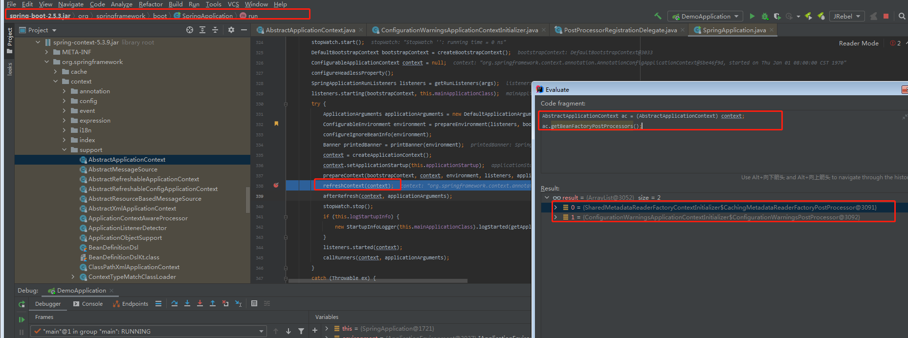
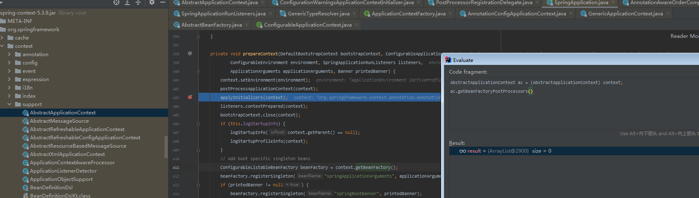
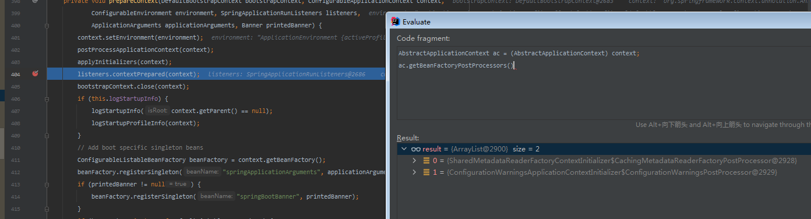
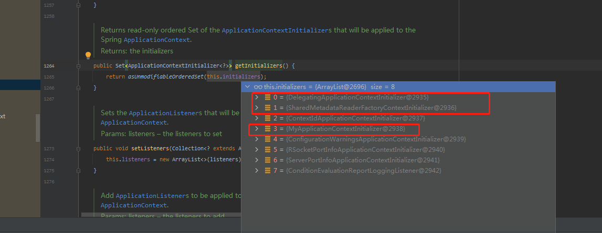

### 什么地方把这两个对象放到beanFactoryPostProcessors

我的排查手段是先确定是在`spring`的`refresh`方法前加载的还是在之后加载的。通过DEBUG 调用`getBeanFactoryPostProcessors() `方法。发现已经存在这两个对象。


那么可以大概猜测是从`spring boot` 初始化加载的




既然这样,那就在调用`refreshContext()`看下`getBeanFactoryPostProcessors()`结果

没错  也是两个  






最终发现是`org.springframework.boot.SpringApplication#applyInitializers`这个方法把值塞进去了


```java
protected void applyInitializers(ConfigurableApplicationContext context) {
   for (ApplicationContextInitializer initializer : getInitializers()) {
      Class<?> requiredType = GenericTypeResolver.resolveTypeArgument(initializer.getClass(),
            ApplicationContextInitializer.class);
      Assert.isInstanceOf(requiredType, context, "Unable to call initializer.");
      initializer.initialize(context);
   }
}


	public Set<ApplicationContextInitializer<?>> getInitializers() {
		return asUnmodifiableOrderedSet(this.initializers);
	}

```

`applyInitializers` 方法如上:

发现是通过获取`getInitializers()`返回的集合 进行遍历。执行

`initializer.initialize(context);`方法



通过查看`this.initializers`元素的值发现。除了自己写的`MyApplicationContextInitializer` 。还有两个（下标1 、2）的类有点跟我们要找的结果有点相似


```java
class SharedMetadataReaderFactoryContextInitializer implements ApplicationContextInitializer<ConfigurableApplicationContext>, Ordered {
    public static final String BEAN_NAME = "org.springframework.boot.autoconfigure.internalCachingMetadataReaderFactory";

    SharedMetadataReaderFactoryContextInitializer() {
    }
    
    @Override
	public void initialize(ConfigurableApplicationContext applicationContext) {
		BeanFactoryPostProcessor postProcessor = new CachingMetadataReaderFactoryPostProcessor(applicationContext);
		applicationContext.addBeanFactoryPostProcessor(postProcessor);
	}
    
    @Override
    public void postProcessBeanDefinitionRegistry(BeanDefinitionRegistry registry) throws BeansException {
        register(registry);
        configureConfigurationClassPostProcessor(registry);
    }

	static class CachingMetadataReaderFactoryPostProcessor
			implements BeanDefinitionRegistryPostProcessor, PriorityOrdered {

		private final ConfigurableApplicationContext context;

		CachingMetadataReaderFactoryPostProcessor(ConfigurableApplicationContext context) {
			this.context = context;
		}

		@Override
		public int getOrder() {
			// Must happen before the ConfigurationClassPostProcessor is created
			return Ordered.HIGHEST_PRECEDENCE;
		}

		@Override
		public void postProcessBeanFactory(ConfigurableListableBeanFactory beanFactory) throws BeansException {
		}

		@Override
		public void postProcessBeanDefinitionRegistry(BeanDefinitionRegistry registry) throws BeansException {
			register(registry);
			configureConfigurationClassPostProcessor(registry);
		}

		private void register(BeanDefinitionRegistry registry) {
			BeanDefinition definition = BeanDefinitionBuilder
					.genericBeanDefinition(SharedMetadataReaderFactoryBean.class, SharedMetadataReaderFactoryBean::new)
					.getBeanDefinition();
			registry.registerBeanDefinition(BEAN_NAME, definition);
		}

		private void configureConfigurationClassPostProcessor(BeanDefinitionRegistry registry) {
			try {
				configureConfigurationClassPostProcessor(
						registry.getBeanDefinition(AnnotationConfigUtils.CONFIGURATION_ANNOTATION_PROCESSOR_BEAN_NAME));
			}
			catch (NoSuchBeanDefinitionException ex) {
			}
		}

		private void configureConfigurationClassPostProcessor(BeanDefinition definition) {
			if (definition instanceof AbstractBeanDefinition) {
				configureConfigurationClassPostProcessor((AbstractBeanDefinition) definition);
				return;
			}
			configureConfigurationClassPostProcessor(definition.getPropertyValues());
		}

		private void configureConfigurationClassPostProcessor(AbstractBeanDefinition definition) {
			Supplier<?> instanceSupplier = definition.getInstanceSupplier();
			if (instanceSupplier != null) {
				definition.setInstanceSupplier(
						new ConfigurationClassPostProcessorCustomizingSupplier(this.context, instanceSupplier));
				return;
			}
			configureConfigurationClassPostProcessor(definition.getPropertyValues());
		}

		private void configureConfigurationClassPostProcessor(MutablePropertyValues propertyValues) {
			propertyValues.add("metadataReaderFactory", new RuntimeBeanReference(BEAN_NAME));
		}
}

```

找到下标1的`class`。

很明显，再调用`initialize`方法时。创建了一个`BeanFactoryPostProcessor`给context
