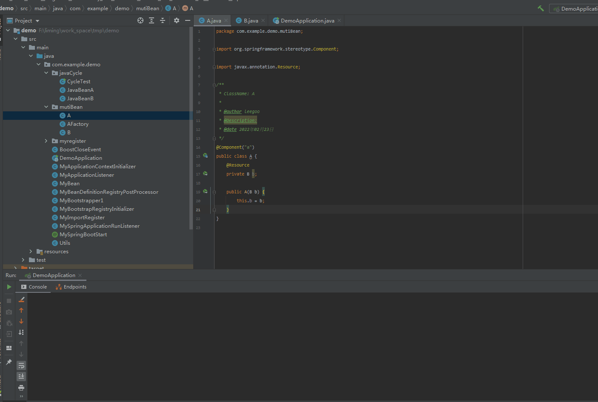
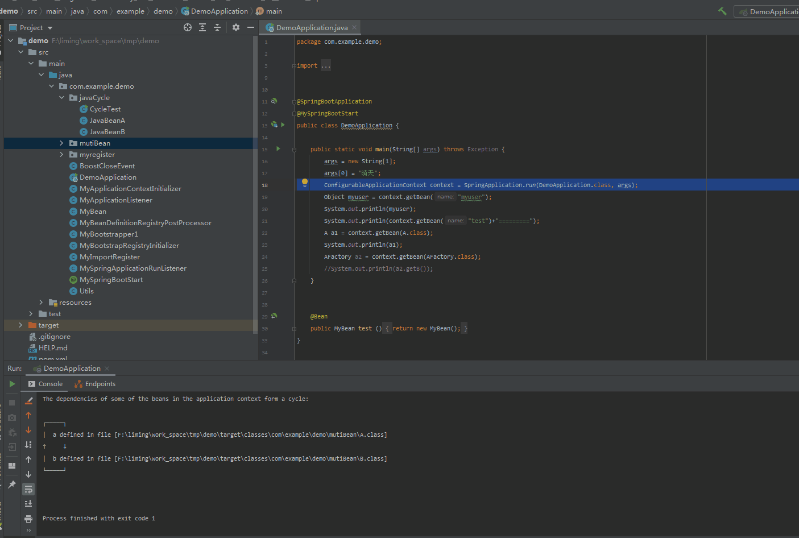
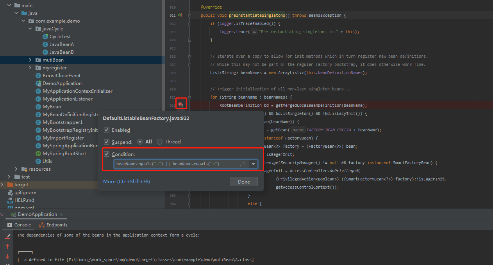
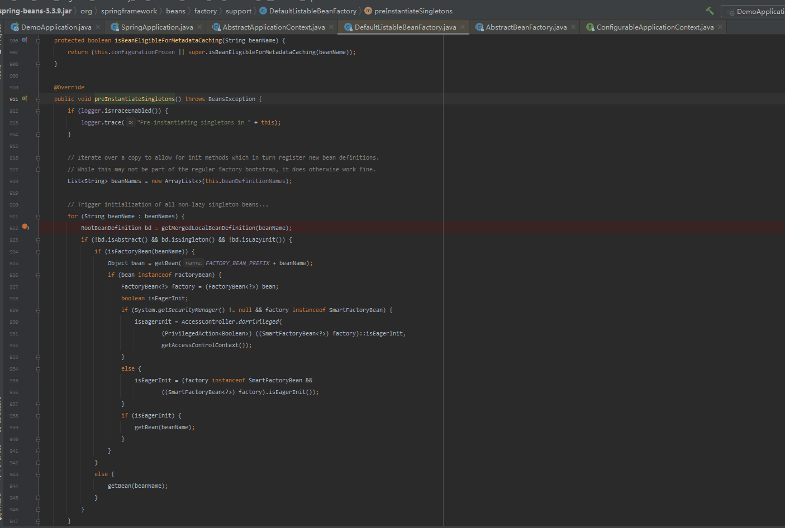

**文章内容如有错误,欢迎指出**

在上一章，已经了解了后置处理的一些知识，以及了解到`main`函数上面的那些`spring`注解初始化过程。也了解到`beanFactoryPostProcess`是怎么一个大致工作流程

那么这一章，将去了解`bean`实例化过程

由于自己已经提前看了很多遍代码。发现如果要全部贴上来的话，非常影响阅读。同时贴太多的代码也不容易记得调用过程。

所以从这章开始，贴代码的会比较少。着重记录一些阅读源码的简单过程和心得。

本章主要了解两个问题

1.`bean`的实例化过程（`getBean()`）

2.三级缓存(其实看了几遍代码没确定它的实质性作用，更想定义为如何解决循环依赖)

那么直接开干

先看一下`java`的循环依赖

```java
public class JavaBeanA {
    JavaBeanB beanB;

    public JavaBeanA(JavaBeanB beanB) {
        this.beanB = beanB;
    }
}
```

```java
public class JavaBeanB {
    private JavaBeanA javaBeanA;

    public JavaBeanB(JavaBeanA javaBeanA) {
        this.javaBeanA = javaBeanA;
    }
}

```

```java
public class CycleTest {
    public static void main(String[] args) {
        JavaBeanA javaBeanA = new JavaBeanA(new JavaBeanB(new JavaBeanA())); //这里因为JavaBeanA/JavaBeanB类只有一个构造方法，根本没有办法实例化。 所以这里会编译报错
        System.out.println(javaBeanA);
    }
}
```

目前能解决编译报错的方式只能不在构造器里面传入`JavaBeanB`

随后我们验证一下，在spring框架下能否解决这个情况




显然，`spring`也没有办法处理构造器循环依赖

那`spring`是如何开始处理 A类里面有成员属性B ， B类里面有成员属性A的呢？




或者直接跳到方法`org.springframework.context.support.AbstractApplicationContext#finishBeanFactoryInitialization`



创建条件断点1（`org.springframework.beans.factory.support.DefaultListableBeanFactory#preInstantiateSingletons`）



创建条件断点2（`org.springframework.beans.factory.support.AbstractBeanFactory#doGetBean`）


3。开始调试


4.结论

当通过`org.springframework.beans.factory.support.DefaultListableBeanFactory#preInstantiateSingletons`实例化所有bean的时

- 对bean做反射，生成唯一对象。
- 处理成员变量 (`org.springframework.context.annotation.CommonAnnotationBeanPostProcessor#postProcessProperties`)
- 在处理成员变量时。会递归调用`getBean()`方法。也就是如果A bean在创建完成之后。会把b也给创建出来

中间省略了一些过程。

确实没有发现循环依赖有什么特别之处。

`spring`的解决办法也很简单。只需要把`beanName`放到一个`Set`集合里面(参考`org.springframework.beans.factory.support.DefaultSingletonBeanRegistry#beforeSingletonCreation`)。

大致如下：

```java
if (!this.inCreationCheckExclusions.contains(beanName) //this.inCreationCheckExclusions.contains(beanName)是false , 加 ! 就是true
    &&   !this.singletonsCurrentlyInCreation.add(beanName)) { //set集合增加元素。增加失败 的话就是false .如果增加失败就会抛异常
			throw new BeanCurrentlyInCreationException(beanName);
		}
```

可能还有一些没有关注到的点。毕竟每个细节都注意的话。`spring`将是一个庞大的工程。


​	
